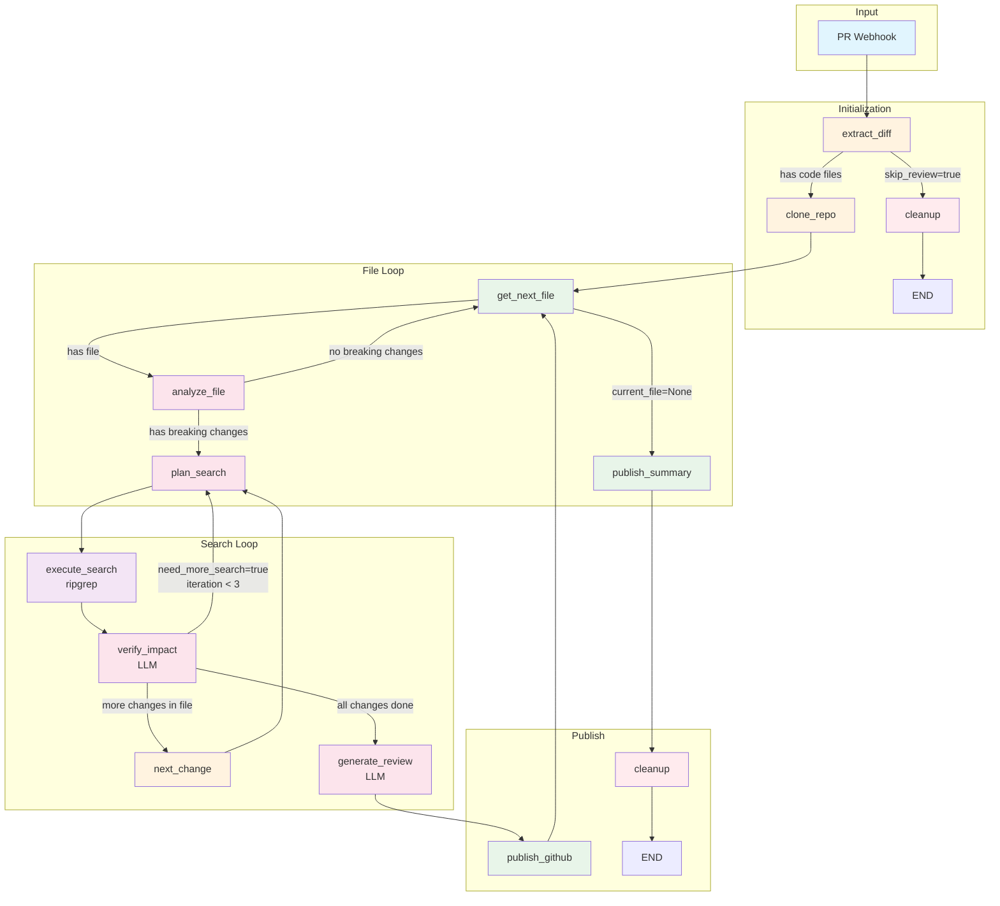

# AI Code Reviewer - Technical Architecture

## Tổng quan

AI Code Reviewer là hệ thống review code tự động sử dụng LangGraph để phát hiện breaking changes trong Pull Request. Hệ thống phân tích từng file thay đổi, tìm kiếm callers bị ảnh hưởng trong codebase, và post comments lên GitHub.

## LLM Provider

Hệ thống sử dụng một trong các LLM providers sau (theo thứ tự ưu tiên):

| Priority | Provider | Model |
|----------|----------|-------|
| 1 | OpenRouter | `xiaomi/mimo-v2-flash:free` |
| 2 | OpenAI | `gpt-4o-mini` |
| 3 | Anthropic | `claude-3-5-sonnet-20241022` |
| 4 | Google | `gemini-2.0-flash` |

Chỉ cần config 1 provider trong `.env` là đủ.

---

## Workflow Graph

Workflow xử lý theo 2 vòng lặp lồng nhau:

1. **File Loop**: Duyệt qua từng file thay đổi trong PR
2. **Search Loop**: Với mỗi breaking change, tìm và verify các callers bị ảnh hưởng (tối đa 3 iterations)

Sau khi xử lý xong mỗi file, comments được publish ngay lên GitHub (không đợi hết tất cả files).



---

## ReviewState

State được truyền qua các nodes trong workflow:

```python
class ReviewState(TypedDict, total=False):
    # ─────────────────────────────────────────────────────────────────
    # Input
    # ─────────────────────────────────────────────────────────────────
    pr_context: PRContext          # PR info từ webhook

    # ─────────────────────────────────────────────────────────────────
    # extract_diff + clone_repo output
    # ─────────────────────────────────────────────────────────────────
    file_diffs: list[FileDiff]     # Tất cả files thay đổi trong PR
    repo_path: str                 # Path đến cloned repo

    # ─────────────────────────────────────────────────────────────────
    # File loop state
    # ─────────────────────────────────────────────────────────────────
    pending_files: list[FileDiff]  # Files còn lại cần process
    current_file: FileDiff | None  # File đang được process

    # ─────────────────────────────────────────────────────────────────
    # analyze_file output (per file)
    # ─────────────────────────────────────────────────────────────────
    file_changes: list[DetectedChange]   # Breaking changes trong file hiện tại
    current_change_index: int            # Index của change đang xử lý
    current_change: DetectedChange | None # Change đang được search

    # ─────────────────────────────────────────────────────────────────
    # Search loop state (per change)
    # ─────────────────────────────────────────────────────────────────
    search_plan: SearchPlan | None       # LLM's search queries
    search_results: list[SearchResult]   # Kết quả từ ripgrep
    verified_callers: list[AffectedCaller] # Callers đã verify
    need_more_search: bool               # Cần search thêm không
    additional_queries: list[str]        # Queries bổ sung
    search_iteration: int                # Số lần search (max 3)

    # ─────────────────────────────────────────────────────────────────
    # Per-file results
    # ─────────────────────────────────────────────────────────────────
    file_breaking_changes: list[BreakingChange]
    file_comments: list[ReviewComment]

    # ─────────────────────────────────────────────────────────────────
    # Accumulated results (across all files) - sử dụng operator.add
    # ─────────────────────────────────────────────────────────────────
    all_breaking_changes: Annotated[list[BreakingChange], operator.add]
    all_comments: Annotated[list[ReviewComment], operator.add]
    published_comments: Annotated[list[ReviewComment], operator.add]

    # ─────────────────────────────────────────────────────────────────
    # Control flags
    # ─────────────────────────────────────────────────────────────────
    skip_review: bool              # Skip nếu không có code files
    skip_reason: str | None
    errors: list[str]
```

---

## Data Models

### PRContext (Input)
```python
@dataclass
class PRContext:
    owner: str              # "myorg"
    repo: str               # "myrepo"
    pr_number: int          # 123
    title: str
    author: str
    installation_id: int
    base_branch: str        # "main"
    head_branch: str        # "feature/payment"
```

### FileDiff
```python
@dataclass
class FileDiff:
    file_path: str          # "src/Payment.php"
    status: str             # "added" | "modified" | "deleted" | "renamed"
    base_content: str | None
    head_content: str | None
    patch: str              # Git diff
    language: str | None
```

### DetectedChange (từ analyze_file)
```python
@dataclass
class DetectedChange:
    entity_type: str        # "function" | "method" | "constant" | "class"
    entity_name: str        # "processPayment"
    class_name: str | None  # "PaymentService"
    file_path: str
    language: str
    change_type: str        # "signature_changed" | "deleted" | "visibility_changed"
    old_definition: str | None
    new_definition: str | None
    change_detail: str      # "Added required parameter: $customerId"
    line: int               # Line number trong new file
```

### SearchPlan (từ plan_search)
```python
@dataclass
class SearchPlan:
    queries: list[str]          # ["processPayment(", "PaymentService::"]
    include_patterns: list[str] # ["*.php"]
    exclude_patterns: list[str] # ["*test*", "*vendor*"]
    reasoning: str
```

### SearchResult (từ execute_search)
```python
@dataclass
class SearchResult:
    file_path: str
    line: int
    match_text: str         # Dòng code match
    context: str            # Surrounding lines
```

### AffectedCaller (từ verify_impact)
```python
@dataclass
class AffectedCaller:
    file_path: str
    line: int
    call_text: str          # "processPayment($amount, $method)"
    break_reason: str       # "Missing required parameter: $customerId"
```

### BreakingChange (final result)
```python
@dataclass
class BreakingChange:
    entity_type: str
    entity_name: str
    class_name: str | None
    file_path: str
    change_type: str
    old_definition: str | None
    new_definition: str | None
    change_detail: str
    line: int
    affected_callers: list[AffectedCaller]
    severity: str           # "critical" (≥3 callers) | "warning"
    recommendation: str
```

### ReviewComment (output)
```python
@dataclass
class ReviewComment:
    file: str
    line: int
    severity: str           # "critical" | "warning" | "info"
    message: str
    affected_files: list[dict]  # [{path, line, reason}]
    recommendation: str
```

---

## Routing Logic

### route_after_extract
```python
skip_review=True  → cleanup → END
else              → clone_repo
```

### route_after_get_file
```python
current_file=None → publish_summary → cleanup → END
else              → analyze_file
```

### route_after_analyze
```python
no file_changes   → get_next_file (skip file)
has file_changes  → plan_search
```

### route_after_verify
```python
need_more_search=True AND iteration < 3  → plan_search (loop)
more changes in file                      → next_change → plan_search
else                                      → generate_review
```

### route_after_publish
```python
always → get_next_file (process next file)
```

---

## Node Descriptions

| Node | Input | Output | Description |
|------|-------|--------|-------------|
| `extract_diff` | PRContext | file_diffs, pending_files | Fetch PR files từ GitHub API |
| `clone_repo` | PRContext | repo_path | Shallow clone repo để search local |
| `get_next_file` | pending_files | current_file | Pop file tiếp theo từ queue |
| `analyze_file` | current_file | file_changes | LLM detect breaking changes |
| `plan_search` | current_change | search_plan | LLM generate search queries |
| `execute_search` | search_plan, repo_path | search_results | Run ripgrep |
| `verify_impact` | search_results, current_change | verified_callers, need_more_search | LLM verify callers |
| `next_change` | file_changes, current_change_index | current_change | Move to next change |
| `generate_review` | file_breaking_changes | file_comments | LLM format comments |
| `publish_github` | file_comments | published_comments | Post to GitHub PR |
| `publish_summary` | all_breaking_changes | slack_result | Send Slack notification |
| `cleanup` | repo_path | - | Delete cloned repo |

---

## Search Configuration

```python
MAX_SEARCH_ITERATIONS = 3      # Max lần search per change
MAX_RESULTS_PER_QUERY = 20     # Max results per query
SEARCH_CONTEXT_LINES = 3       # Context lines around match

SEARCH_EXCLUDE_DIRS = [
    "**/node_modules/**",
    "**/vendor/**",
    "**/.git/**",
    "**/dist/**",
    "**/build/**",
]
```
