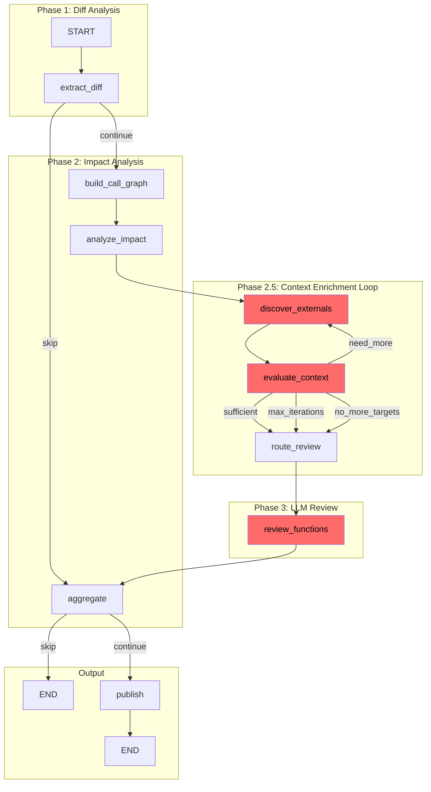
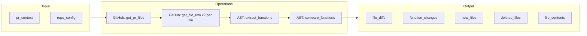
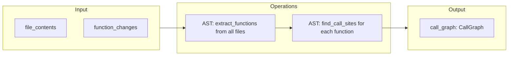
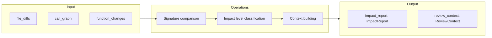
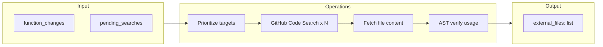
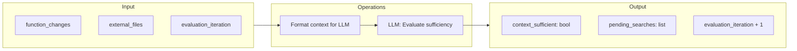
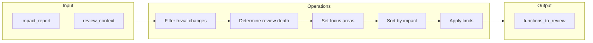
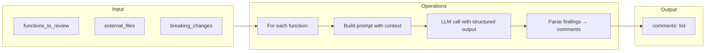
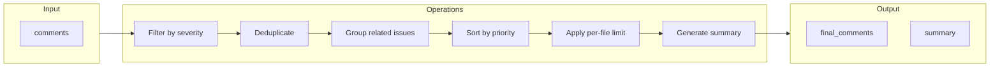
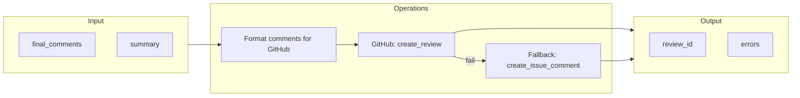

# Code Review Agent: Workflow Analysis & Bottleneck Identification

> **Document Version**: 1.0  
> **Generated**: January 2026  
> **Purpose**: Comprehensive analysis of the PR review workflow, data flow, and performance bottlenecks

---

## Table of Contents

1. [Executive Summary](#executive-summary)
2. [Current Workflow Overview](#current-workflow-overview)
3. [State-by-State Breakdown](#state-by-state-breakdown)
4. [Data Flow Analysis](#data-flow-analysis)
5. [Bottleneck Identification](#bottleneck-identification)
6. [Optimization Recommendations](#optimization-recommendations)
7. [Priority Matrix](#priority-matrix)

---

## Executive Summary

The PR review agent implements a **3-phase pipeline** with an **evaluator-optimizer loop**:

| Phase | Nodes | Type | Bottleneck Risk |
|-------|-------|------|-----------------|
| **Phase 1** | `extract_diff` | Deterministic | 🟡 Medium (GitHub API) |
| **Phase 2** | `build_call_graph` → `analyze_impact` | AST-based | 🟢 Low |
| **Phase 2.5** | `discover_externals` ⟷ `evaluate_context` | LLM + API | 🔴 High |
| **Phase 3** | `route_review` → `review_functions` | LLM-based | 🔴 High |
| **Output** | `aggregate` → `publish` | Deterministic | 🟢 Low |

**Key Finding**: The main bottlenecks are in **Phase 2.5** (external discovery loop) and **Phase 3** (sequential function reviews).

---

## Current Workflow Overview

### High-Level Architecture



### Workflow Characteristics

| Characteristic | Value | Notes |
|----------------|-------|-------|
| **Total Nodes** | 9 | Including conditional routing |
| **LLM Calls** | 2-4+ per review | `evaluate_context` (0-3x) + `review_functions` (1x per function) |
| **API Calls** | 15-50+ | GitHub: PR files, contents, search, publish |
| **Loops** | 1 | Evaluator-optimizer loop (max 3 iterations) |
| **Parallelism** | None currently | Functions reviewed sequentially |

---

## State-by-State Breakdown

### Node 1: `extract_diff`

**Phase**: 1 (Diff Analysis)  
**Type**: Deterministic (No LLM)



#### Operations

| Operation | Description | I/O Bound |
|-----------|-------------|-----------|
| `get_pr_files()` | Fetch list of changed files | Network |
| `get_file_raw()` | Fetch base & head content per file | Network (x2 per file) |
| `extract_functions()` | Parse AST to extract functions | CPU |
| `compare_functions()` | Diff old vs new function lists | CPU |

#### Data Variables

```python
# Input (from webhook/initial state)
pr_context: PRContext  # owner, repo, pr_number, branches
repo_config: ReviewerConfig  # ignore patterns, limits

# Output
file_diffs: list[FileDiff]  # Parsed diff info with content
function_changes: dict[str, dict]  # {func_name: {type, old, new}}
file_contents: dict[str, str]  # {path: content}
new_files: list[str]
deleted_files: list[str]
skip_review: bool  # True if no relevant files
```

#### Potential Bottlenecks

| Issue | Severity | Cause |
|-------|----------|-------|
| **Sequential file fetching** | 🟡 Medium | Files fetched one-by-one with `asyncio.gather` only for base/head of same file |
| **Large file content** | 🟡 Medium | Full file content stored in memory |
| **Many files in PR** | 🟡 Medium | Linear scaling with file count |

#### Transitions

- `skip_review=True` → Goes to `aggregate` (skip)
- `skip_review=False` → Goes to `build_call_graph`

---

### Node 2: `build_call_graph`

**Phase**: 2a (Impact Analysis)  
**Type**: Deterministic (No LLM)



#### Operations

| Operation | Description | Complexity |
|-----------|-------------|------------|
| `extract_functions()` | Parse each file for function definitions | O(files × lines) |
| `find_call_sites()` | For each function, search all other files | O(functions × files × lines) |

#### Data Variables

```python
# Input
file_contents: dict[str, str]  # From extract_diff

# Output  
call_graph: CallGraph
  - relations: dict[str, CallRelation]  # func_name -> callers/callees
  - file_functions: dict[str, list[str]]  # file -> function names
```

#### Potential Bottlenecks

| Issue | Severity | Cause |
|-------|----------|-------|
| **O(n²) call site search** | 🟡 Medium | Every function checked against every file |
| **Only searches PR files** | ⚠️ Limitation | Misses callers in files not in the PR |

---

### Node 3: `analyze_impact`

**Phase**: 2b (Impact Analysis)  
**Type**: Deterministic (No LLM)



#### Operations

| Operation | Description |
|-----------|-------------|
| Signature comparison | Detect breaking changes to function signatures |
| Impact classification | Assign CRITICAL/HIGH/MEDIUM/LOW/TRIVIAL |
| Context building | Assemble `FunctionContext` for each function |
| Callee resolution | Resolve callee source code from `file_contents` |

#### Data Variables

```python
# Input
file_diffs, call_graph, function_changes, file_contents

# Output
impact_report: ImpactReport
  - functions: list[FunctionImpact]
  - breaking_changes: list[ImpactWarning]
  - warnings: list[ImpactWarning]
  - test_coverage: dict[str, bool]

review_context: ReviewContext
  - functions: list[FunctionContext]  # Ready for LLM review
  - breaking_changes, warnings, new_files, deleted_files
```

#### Potential Bottlenecks

| Issue | Severity | Cause |
|-------|----------|-------|
| **Callee resolution sync** | 🟢 Low | Currently in-memory only |
| **Test detection heuristic** | 🟢 Low | Simple pattern matching |

---

### Node 4: `discover_externals`

**Phase**: 2.5a (Context Enrichment)  
**Type**: API-bound (GitHub Code Search)



#### Operations

| Operation | Description | I/O Bound |
|-----------|-------------|-----------|
| `_prioritize_targets()` | Limit search targets to 10 | CPU |
| `search_code()` | GitHub Code Search API (per target) | Network |
| `get_file_raw()` | Fetch content for each candidate | Network |
| `_verify_usage()` | AST check for actual usage | CPU |

#### Data Variables

```python
# Input
function_changes: dict  # Initial targets
pending_searches: list[str]  # From LLM evaluator (subsequent iterations)
evaluation_iteration: int

# Output
external_files: list[ExternalFile]
  - path, content, usage_type, affected_lines
  - will_break, break_reason, references
pending_searches: []  # Cleared
```

#### Potential Bottlenecks

| Issue | Severity | Cause |
|-------|----------|-------|
| **🔴 Sequential API calls** | High | 1 second delay between searches (rate limit protection) |
| **🔴 Rate limiting** | High | GitHub Code Search has strict limits |
| **🟡 Sequential file fetching** | Medium | Each candidate file fetched individually |
| **🟡 Loop iterations** | Medium | Up to 3 iterations of discovery → evaluation |

#### Rate Limit Impact

```
MAX_SEARCHES_PER_ITERATION = 10
SEARCH_DELAY_SECONDS = 1.0

Worst case per iteration:
- 10 searches × 1s delay = 10s just for delays
- + actual API response time
- + file fetching time
- = ~15-20s per iteration
- × 3 iterations = 45-60s total
```

---

### Node 5: `evaluate_context`

**Phase**: 2.5b (Context Enrichment)  
**Type**: LLM-bound



#### Operations

| Operation | Description | I/O Bound |
|-----------|-------------|-----------|
| `format_changed_code()` | Serialize function changes | CPU |
| `format_external_files()` | Serialize external files | CPU |
| `llm.ainvoke()` | LLM call with structured output | Network + Compute |

#### Data Variables

```python
# Input
function_changes, external_files, evaluation_iteration

# Output
context_sufficient: bool  # LLM decision
pending_searches: list[str]  # Suggestions for next iteration
evaluation_iteration: int  # Incremented

# LLM Output Schema
class ContextEvaluation(BaseModel):
    context_sufficient: bool
    confidence: float
    need_more_context_for: list[str]  # Classes/services to search
    reasoning: str
```

#### Potential Bottlenecks

| Issue | Severity | Cause |
|-------|----------|-------|
| **🔴 LLM latency** | High | 2-5s per call |
| **🟡 Token usage** | Medium | Large context = expensive |

#### Transition Logic

```python
def should_continue(state):
    if state.get("context_sufficient"):
        return "sufficient"  # → route_review
    
    if state.get("evaluation_iteration") >= 3:
        return "max_iterations"  # → route_review
    
    if not state.get("pending_searches"):
        return "no_more_targets"  # → route_review
    
    return "need_more"  # → discover_externals (LOOP)
```

---

### Node 6: `route_review`

**Phase**: 3a (Review Routing)  
**Type**: Deterministic (Heuristics)



#### Operations

| Operation | Description |
|-----------|-------------|
| `_is_trivial_change()` | Skip TRIVIAL impact functions |
| `_determine_review_depth()` | deep/standard/quick |
| `_determine_focus_areas()` | backward_compatibility, caller_impact, etc. |
| Sort by impact | CRITICAL → HIGH → MEDIUM → LOW |
| Limit | max_functions_to_review (default 20) |

#### Data Variables

```python
# Output
functions_to_review: list[FunctionReviewInput]
  - function_context: FunctionContext
  - review_depth: "deep" | "standard" | "quick"
  - focus_areas: list[str]
```

#### Potential Bottlenecks

| Issue | Severity | Cause |
|-------|----------|-------|
| 🟢 None significant | Low | Pure in-memory operations |

---

### Node 7: `review_functions`

**Phase**: 3b (LLM Review)  
**Type**: LLM-bound



#### Operations

| Operation | Description | I/O Bound |
|-----------|-------------|-----------|
| `build_function_review_prompt()` | Build comprehensive prompt | CPU |
| `llm.ainvoke()` | LLM call per function | Network + Compute |
| Parse findings | Convert `AgentFindings` → `ReviewComment` | CPU |

#### Data Variables

```python
# Input
functions_to_review: list[FunctionReviewInput]
external_files: list[ExternalFile]  # From discovery
breaking_changes: list[str]

# Output
comments: list[ReviewComment]  # Merged via operator.add
```

#### Potential Bottlenecks

| Issue | Severity | Cause |
|-------|----------|-------|
| **🔴 SEQUENTIAL LLM calls** | Critical | `for review_input in functions_to_review` |
| **🔴 Large prompts** | High | Callers + callees + external files = many tokens |
| **🟡 No batching** | Medium | Each function is a separate API call |

#### Current Implementation (Sequential)

```python
# review_function.py:256
for review_input in functions_to_review:
    comments = await review_single_function(
        review_input,
        external_files=external_files,
        breaking_changes=breaking_changes,
    )
    all_comments.extend(comments)
```

**Time Impact**:
```
5 functions × 5s/function = 25s
10 functions × 5s/function = 50s
20 functions × 5s/function = 100s (1:40)
```

---

### Node 8: `aggregate`

**Phase**: Output  
**Type**: Deterministic



#### Operations

| Operation | Description |
|-----------|-------------|
| `_filter_by_severity()` | Keep only critical + warning |
| `_deduplicate()` | By (file, line, category) |
| `_group_related_issues()` | Semantic grouping by issue type |
| `_sort_by_priority()` | severity → confidence |
| `_limit_per_file()` | max 10 per file |
| `_generate_summary()` | Markdown summary |

#### Potential Bottlenecks

| Issue | Severity | Cause |
|-------|----------|-------|
| 🟢 None significant | Low | In-memory operations on small lists |

---

### Node 9: `publish`

**Phase**: Output  
**Type**: API-bound (GitHub)



#### Operations

| Operation | Description | I/O Bound |
|-----------|-------------|-----------|
| `_build_review_payload()` | Format comments | CPU |
| `create_review()` | Post PR review | Network |
| `create_issue_comment()` | Fallback posting | Network |

#### Potential Bottlenecks

| Issue | Severity | Cause |
|-------|----------|-------|
| 🟢 Single API call | Low | GitHub handles batched comments |
| 🟡 Fallback latency | Low | Only on error |

---

## Data Flow Analysis

### Complete State Evolution

```
┌─────────────────────────────────────────────────────────────────────────────┐
│                           STATE SIZE GROWTH                                  │
├─────────────────────────────────────────────────────────────────────────────┤
│                                                                              │
│  Initial:      ~1 KB (pr_context, repo_config)                              │
│                                                                              │
│  extract_diff: ~50 KB - 5 MB                                                 │
│    └── file_contents: Full source of all changed files                      │
│                                                                              │
│  build_call_graph: +10 KB                                                   │
│    └── call_graph: Function relationships                                   │
│                                                                              │
│  analyze_impact: +20 KB                                                     │
│    └── impact_report, review_context                                        │
│                                                                              │
│  discover_externals: +100 KB - 2 MB (per iteration)                         │
│    └── external_files: Full content of discovered files                     │
│                                                                              │
│  evaluate_context: ~same                                                    │
│                                                                              │
│  review_functions: +5 KB                                                    │
│    └── comments: Review findings                                            │
│                                                                              │
│  aggregate: ~same (filtered)                                                │
│                                                                              │
│  TOTAL PEAK: 100 KB - 10 MB depending on PR size                            │
│                                                                              │
└─────────────────────────────────────────────────────────────────────────────┘
```

### Token Usage Analysis

```
┌────────────────────────────────────────────────────────────────────────────┐
│                         LLM TOKEN CONSUMPTION                               │
├────────────────────────────────────────────────────────────────────────────┤
│                                                                             │
│  evaluate_context (per call):                                               │
│    Input:  ~2,000 - 10,000 tokens                                          │
│    Output: ~100 - 500 tokens                                                │
│    Calls:  1-3 per review                                                   │
│                                                                             │
│  review_functions (per function):                                           │
│    Input:  ~1,000 - 5,000 tokens                                           │
│      - System prompt: ~600 tokens                                           │
│      - Function code: ~200-1000 tokens                                      │
│      - Callers (5 max): ~500-2000 tokens                                    │
│      - Callees: ~200-1000 tokens                                            │
│      - External files: ~200-1000 tokens                                     │
│    Output: ~200 - 1,000 tokens                                              │
│    Calls:  1 per function                                                   │
│                                                                             │
│  Example: 10 functions review                                               │
│    evaluate_context: 3 × 5,000 = 15,000 tokens                             │
│    review_functions: 10 × 3,000 = 30,000 tokens                            │
│    TOTAL: ~45,000 tokens = ~$0.05-0.50 depending on model                  │
│                                                                             │
└────────────────────────────────────────────────────────────────────────────┘
```

---

## Bottleneck Identification

### Critical Bottlenecks (🔴)

#### 1. Sequential Function Reviews

**Location**: `review_function.py:256`

```python
for review_input in functions_to_review:
    comments = await review_single_function(...)
    all_comments.extend(comments)
```

**Impact**:
- 5s per function × 20 functions = 100s (1:40)
- Linear scaling with function count
- No parallelism despite independent operations

**Evidence**: Each function review is completely independent - no shared state mutations.

#### 2. External Discovery Loop Latency

**Location**: `discover_externals.py:125-155`

```python
for i, target in enumerate(search_targets, 1):
    if i > 1:
        await asyncio.sleep(SEARCH_DELAY_SECONDS)  # 1s delay!
    results = await self.github.search_code(query, per_page=30)
```

**Impact**:
- 10 searches × 1s delay = 10s just in sleeps
- Plus actual API latency (~0.5s each)
- Up to 3 iterations = 45s+ in worst case

#### 3. Sequential File Content Fetching in Discovery

**Location**: `discover_externals.py:173-181`

```python
for path, item in candidates.items():
    content = await self.github.get_file_raw(...)  # Sequential!
```

**Impact**:
- 30 candidates × 0.3s = 9s
- Could be parallelized

### Medium Bottlenecks (🟡)

#### 4. Large Prompt Token Usage

**Location**: `function_review.py:84-320`

**Issue**: Prompts include full source code for:
- The function itself
- Up to 5 callers with context
- All callees with source
- Up to 10 external files

**Impact**: 
- Token costs scale with codebase verbosity
- API latency increases with prompt size

#### 5. Full File Content in State

**Location**: `extract_diff.py:83`

```python
file_contents: dict[str, str] = {}
```

**Issue**: Entire file content stored, not just relevant portions.

**Impact**:
- Memory usage for large files
- Unnecessary data transfer through workflow

### Low Bottlenecks (🟢)

#### 6. AST Parsing Overhead

**Location**: Various `extract_functions()` calls

**Issue**: Tree-sitter parsing for each file

**Impact**: Minimal - tree-sitter is very fast (~10ms per file)

#### 7. GitHub API Rate Limits

**Location**: All GitHub API calls

**Issue**: Potential for hitting rate limits on large repos

**Impact**: Mitigated by delays in discovery, but could fail

---

## Optimization Recommendations

### High Priority: Parallelize Function Reviews

**Current**:
```python
for review_input in functions_to_review:
    comments = await review_single_function(...)
```

**Proposed**:
```python
import asyncio

# Parallel with concurrency limit
semaphore = asyncio.Semaphore(5)  # Max 5 concurrent

async def review_with_limit(review_input):
    async with semaphore:
        return await review_single_function(review_input, ...)

tasks = [review_with_limit(r) for r in functions_to_review]
results = await asyncio.gather(*tasks)
all_comments = [c for result in results for c in result]
```

**Expected Improvement**:
- 10 functions: 50s → 10s (5x speedup)
- 20 functions: 100s → 20s (5x speedup)

### High Priority: Parallelize External File Fetching

**Current**:
```python
for path, item in candidates.items():
    content = await self.github.get_file_raw(...)
```

**Proposed**:
```python
async def fetch_candidate(path, item):
    content = await self.github.get_file_raw(...)
    if content:
        return self._verify_usage(content, path, ...)
    return None

tasks = [fetch_candidate(p, i) for p, i in candidates.items()]
results = await asyncio.gather(*tasks, return_exceptions=True)
verified = [r for r in results if r and not isinstance(r, Exception)]
```

**Expected Improvement**: 30 files × 0.3s = 9s → ~1s (9x speedup)

### Medium Priority: Optimize Discovery Loop

**Option A: Batch Search Queries**

Instead of 10 sequential searches, use OR queries:
```python
query = f"({' OR '.join(targets[:5])}) repo:{owner}/{repo}"
```

**Option B: Reduce Loop Iterations**

Lower `MAX_ENRICHMENT_ITERATIONS` from 3 to 2, or make context evaluation more aggressive.

**Option C: Cache External Discovery Results**

Store discovered files in Redis with TTL, skip re-discovery for unchanged base code.

### Medium Priority: Reduce Prompt Token Usage

**Strategy 1: Truncate Code Context**
```python
# Instead of full callee source
callee_snippet = callee.source_code[:500] if len(callee.source_code) > 500 else callee.source_code
```

**Strategy 2: Summarize Instead of Include**
```python
# For callees with known behavior
callees_summary = f"Calls {len(callees)} functions: {', '.join(c.name for c in callees)}"
```

**Strategy 3: Dynamic Context Based on Depth**
```python
match review_depth:
    case "deep":
        max_callers = 5
        include_callees = True
    case "standard":
        max_callers = 3
        include_callees = False
    case "quick":
        max_callers = 1
        include_callees = False
```

### Low Priority: Streaming State

Instead of storing full file contents:
```python
# Store references, fetch on demand
file_refs: dict[str, FileRef]  # {path: (sha, branch)}

async def get_content(self, path: str) -> str:
    ref = self.file_refs[path]
    return await github.get_file_raw(..., ref=ref.sha)
```

### Low Priority: LangGraph Send API for True Parallelism

Use LangGraph's `Send` API for fan-out:
```python
def fan_out_reviews(state: ReviewState) -> list[Send]:
    return [
        Send("review_single", {"function": f, **state})
        for f in state["functions_to_review"]
    ]

# In graph definition
graph.add_conditional_edges("route_review", fan_out_reviews)
graph.add_edge("review_single", "aggregate")
```

---

## Priority Matrix

| Optimization | Impact | Effort | Priority |
|--------------|--------|--------|----------|
| Parallelize function reviews | ⬆️ High | 🟢 Low | **P0** |
| Parallelize file fetching | ⬆️ High | 🟢 Low | **P0** |
| Reduce discovery iterations | ⬆️ Medium | 🟢 Low | **P1** |
| Truncate prompt context | ⬆️ Medium | 🟢 Low | **P1** |
| Batch search queries | ⬆️ Medium | 🟡 Medium | **P2** |
| LangGraph Send API | ⬆️ Medium | 🟡 Medium | **P2** |
| Cache external discovery | ⬆️ Medium | 🔴 High | **P3** |
| Streaming state | ⬆️ Low | 🔴 High | **P3** |

---

## Appendix: Timing Estimates

### Current Pipeline (Worst Case)

| Phase | Node | Time |
|-------|------|------|
| 1 | extract_diff | 5-10s |
| 2a | build_call_graph | 1-2s |
| 2b | analyze_impact | 1-2s |
| 2.5 | discover_externals (×3) | 45-60s |
| 2.5 | evaluate_context (×3) | 10-15s |
| 3a | route_review | <1s |
| 3b | review_functions (×20) | 100s |
| Out | aggregate | <1s |
| Out | publish | 2-3s |
| **TOTAL** | | **~3 minutes** |

### Optimized Pipeline (Expected)

| Phase | Node | Time |
|-------|------|------|
| 1 | extract_diff | 5-10s |
| 2a | build_call_graph | 1-2s |
| 2b | analyze_impact | 1-2s |
| 2.5 | discover_externals (×2) | 15-20s |
| 2.5 | evaluate_context (×2) | 6-10s |
| 3a | route_review | <1s |
| 3b | review_functions (parallel) | 15-20s |
| Out | aggregate | <1s |
| Out | publish | 2-3s |
| **TOTAL** | | **~50-70 seconds** |

**Expected Improvement: 2.5-3x faster**

---

## Conclusion

The primary bottlenecks in the current implementation are:

1. **Sequential function reviews** - Easily parallelizable for ~5x speedup
2. **External discovery loop** - Rate-limited but can be optimized
3. **Sequential file fetching** - Simple asyncio.gather fix

Implementing the P0 and P1 optimizations should reduce review time from ~3 minutes to under 1 minute for typical PRs.
