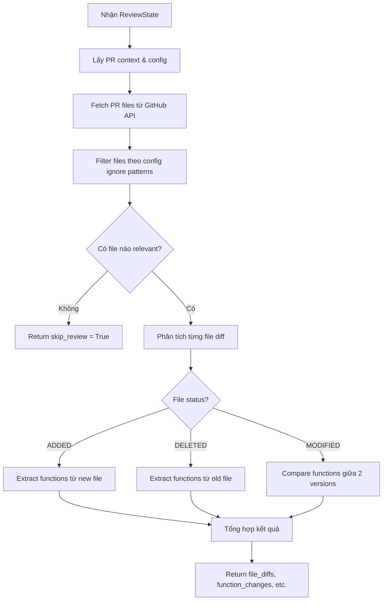

# Extract Diff Node

## 📋 Tổng quan

Node đầu tiên trong pipeline review (Phase 1), thực hiện phân tích diff của Pull Request và trích xuất các thay đổi về code sử dụng AST analysis.

**Đặc điểm:** Node này hoàn toàn deterministic (không dùng LLM).

---

## 🎯 Chức năng chính

Node này có 4 nhiệm vụ chính:

1. **Fetch PR files từ GitHub** - Lấy danh sách các file thay đổi trong PR
2. **Parse diffs** - Phân tích diff thành cấu trúc dữ liệu
3. **Extract changed functions** - Trích xuất các hàm đã thay đổi bằng AST
4. **Identify new/deleted files** - Xác định file mới tạo/bị xóa

---

## 📥 Input (State)

Node nhận vào `ReviewState` với các trường:

| Field | Type | Mô tả |
|-------|------|-------|
| `pr_context` | `PRContext` | Thông tin về PR (owner, repo, pr_number, branches, etc.) |
| `repo_config` | `ReviewerConfig` | Config của repository (ignore patterns, review settings) |

### PRContext bao gồm:
- `owner`: Tên owner của repository
- `repo`: Tên repository
- `pr_number`: Số PR
- `base_branch`: Branch gốc (thường là main/master)
- `head_branch`: Branch có thay đổi
- `installation_id`: GitHub App installation ID

---

## 📤 Output (State Updates)

Node trả về dict cập nhật state với các trường:

| Field | Type | Mô tả |
|-------|------|-------|
| `file_diffs` | `list[FileDiff]` | Danh sách các file diff đã được phân tích |
| `function_changes` | `dict[str, dict]` | Map từ tên hàm → thông tin thay đổi |
| `new_files` | `list[str]` | Danh sách file mới được tạo |
| `deleted_files` | `list[str]` | Danh sách file bị xóa |
| `file_contents` | `dict[str, str]` | Map từ file path → nội dung file |
| `skip_review` | `bool` | Flag để skip review nếu không có file nào cần review |
| `skip_reason` | `str` | Lý do skip (nếu có) |

### FileDiff structure:
```python
{
    "file_path": str,
    "status": ChangeType,  # ADDED, DELETED, MODIFIED, RENAMED
    "base_content": str,   # Nội dung file cũ
    "head_content": str,   # Nội dung file mới
    "patch": str,          # Git diff patch
}
```

### function_changes structure:
```python
{
    "function_name": {
        "type": "added" | "deleted" | "modified",
        "old": FunctionDef,  # Định nghĩa hàm cũ (nếu có)
        "new": FunctionDef,  # Định nghĩa hàm mới (nếu có)
    }
}
```

---

## 🔄 Quy trình xử lý



---

## 🛠️ Công nghệ sử dụng

### Dependencies:
- **DiffExtractor** (`analysis.diff_extractor`): Phân tích git diff
- **AST Analyzer** (`analysis.ast_analyzer`): Trích xuất và so sánh functions
- **GitHubService** (`app.services.github`): Gọi GitHub API

### AST Analysis:
Node sử dụng AST (Abstract Syntax Tree) để:
- Tìm tất cả function definitions trong file
- So sánh signature của functions giữa 2 versions
- Detect changes in function body
- Extract function metadata (name, parameters, return type, etc.)

---

## 🌐 API Calls

### GitHub API:
1. **Get PR Files** - `GET /repos/{owner}/{repo}/pulls/{pr_number}/files`
   - **Input**: owner, repo, pr_number
   - **Output**: List of file changes với patch data
   
2. **Get File Content** - `GET /repos/{owner}/{repo}/contents/{path}?ref={branch}`
   - **Input**: owner, repo, path, ref (branch SHA)
   - **Output**: File content (base64 encoded)

---

## ⚙️ Config & Filtering

Node áp dụng filtering dựa trên `ReviewerConfig`:

```python
# Ignore patterns
ignore_patterns = [
    "*.min.js",
    "*.lock",
    "package-lock.json",
    "yarn.lock",
    # ... etc
]

# Skip patterns (file extensions không review)
skip_patterns = [
    ".md", ".txt", ".json", ".xml",
    ".yaml", ".yml", ".toml",
    # ... etc
]
```

Các file match với patterns này sẽ bị bỏ qua.

---

## 📊 Logging & Metrics

Node log các thông tin sau:

```python
# Start
log.info("extract_diff.started", 
    owner=ctx.owner,
    repo=ctx.repo,
    pr=ctx.pr_number,
    base=ctx.base_branch,
    head=ctx.head_branch,
)

# Skip case
log.info("extract_diff.skipped", 
    reason="no_relevant_files"
)

# Complete
log.info("extract_diff.complete",
    files=len(filtered_diffs),
    functions_changed=len(function_changes),
    new_files=len(new_files),
    deleted_files=len(deleted_files),
)
```

---

## 🔍 Chi tiết kỹ thuật

### ChangeType enum:
```python
class ChangeType(Enum):
    ADDED = "added"
    DELETED = "deleted"
    MODIFIED = "modified"
    RENAMED = "renamed"
```

### FunctionDef structure:
```python
@dataclass
class FunctionDef:
    name: str
    file_path: str
    start_line: int
    end_line: int
    signature: str
    body: str
    parameters: list[Parameter]
    return_type: str | None
```

---

## ⚡ Performance

- **Async operations**: Tất cả GitHub API calls đều async
- **Filtering early**: Apply ignore patterns sớm để giảm số file cần phân tích
- **AST caching**: Sử dụng caching cho AST parser

---

## 🚨 Error Handling

```python
# Config errors
if not ctx:
    raise ValueError("Missing PR context")

# API errors
async with GitHubService(ctx.installation_id) as github:
    try:
        diffs = await extractor.extract(...)
    except GitHubAPIError as e:
        log.error("Failed to fetch PR files", error=str(e))
        raise
```

---

## 🔗 Next Node

Sau node này, state được chuyển đến:
- **build_call_graph** (Phase 2a) - Xây dựng call graph từ function changes

---

## 📝 Example

### Input state:
```python
{
    "pr_context": {
        "owner": "myorg",
        "repo": "myrepo",
        "pr_number": 123,
        "base_branch": "main",
        "head_branch": "feature/new-api",
        "installation_id": 456789
    },
    "repo_config": ReviewerConfig(
        ignore=["*.test.js", "dist/*"]
    )
}
```

### Output state:
```python
{
    "file_diffs": [
        FileDiff(
            file_path="src/api/users.py",
            status=ChangeType.MODIFIED,
            base_content="...",
            head_content="...",
            patch="@@ -10,5 +10,8 @@..."
        )
    ],
    "function_changes": {
        "create_user": {
            "type": "modified",
            "old": FunctionDef(name="create_user", ...),
            "new": FunctionDef(name="create_user", ...)
        },
        "delete_user": {
            "type": "added",
            "new": FunctionDef(name="delete_user", ...)
        }
    },
    "new_files": [],
    "deleted_files": [],
    "file_contents": {
        "src/api/users.py": "def create_user(...):\n    ..."
    },
    "skip_review": False
}
```
