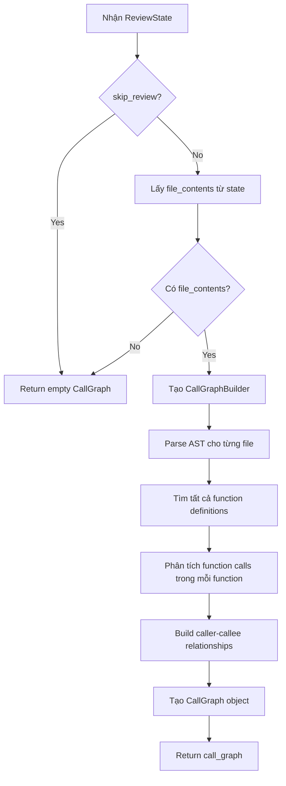

# Build Call Graph Node

## 📋 Tổng quan

Node thứ 2 trong pipeline review (Phase 2a), xây dựng call graph (đồ thị quan hệ gọi hàm) từ code đã thay đổi sử dụng AST analysis.

**Đặc điểm:** Node này hoàn toàn deterministic (không dùng LLM), chỉ phân tích AST.

---

## 🎯 Chức năng chính

Node này xây dựng call relationships:

1. **Find callers** - Tìm các hàm gọi đến hàm đã thay đổi
2. **Find callees** - Tìm các hàm được gọi bởi hàm đã thay đổi
3. **Build relationship graph** - Tạo đồ thị quan hệ để phục vụ impact analysis

---

## 📥 Input (State)

Node nhận vào `ReviewState` với các trường:

| Field | Type | Mô tả |
|-------|------|-------|
| `pr_context` | `PRContext` | Thông tin về PR |
| `file_contents` | `dict[str, str]` | Map file path → nội dung file |
| `skip_review` | `bool` | Flag để skip nếu đã được set |

### file_contents:
```python
{
    "src/api/users.py": "def create_user():\n    ...",
    "src/models/user.py": "class User:\n    ...",
    # ... các file khác
}
```

---

## 📤 Output (State Updates)

Node trả về dict cập nhật state với:

| Field | Type | Mô tả |
|-------|------|-------|
| `call_graph` | `CallGraph` | Đồ thị quan hệ gọi hàm |

### CallGraph structure:
```python
@dataclass
class CallGraph:
    relations: dict[str, CallRelation]
    # Key = function name
    # Value = CallRelation với callers và callees
```

### CallRelation structure:
```python
@dataclass
class CallRelation:
    function_name: str
    file_path: str
    callers: list[CallerInfo]    # Những hàm gọi hàm này
    callees: list[CalleeInfo]    # Những hàm được hàm này gọi
```

### CallerInfo:
```python
@dataclass
class CallerInfo:
    caller: str           # Tên hàm gọi
    caller_file: str      # File chứa caller
    line: int             # Dòng code gọi
    context: str          # Context code xung quanh
```

### CalleeInfo:
```python
@dataclass
class CalleeInfo:
    name: str             # Tên hàm được gọi
    file_path: str        # File chứa hàm
    signature: str        # Signature của hàm
    source_code: str      # Source code của hàm
    has_validation: bool  # Hàm có validate input không
    returns_optional: bool # Hàm có return None không
```

---

## 🔄 Quy trình xử lý



---

## 🛠️ Công nghệ sử dụng

### Dependencies:
- **CallGraphBuilder** (`analysis.call_graph`): Xây dựng call graph từ AST
- **AST Parser**: Parse Python/PHP/JS code thành AST

### AST Analysis:

Node phân tích AST để:

1. **Tìm function definitions**:
   ```python
   def create_user(name):  # Function definition
       validate_name(name)  # Function call
       return User(name)    # Constructor call
   ```

2. **Detect function calls**:
   - Direct calls: `function_name(args)`
   - Method calls: `object.method(args)`
   - Constructor calls: `ClassName(args)`

3. **Build relationships**:
   ```
   create_user (defined in users.py)
   ├─ callers: [handle_request (api.py:45)]
   └─ callees: [validate_name (validators.py), User.__init__ (models.py)]
   ```

---

## 🌐 API Calls

**Không có API calls bên ngoài** - Node này chỉ phân tích code đã có trong memory.

---

## 📊 Logging & Metrics

```python
# Start
log.info("build_call_graph.started",
    owner=ctx.owner,
    repo=ctx.repo,
    files=len(file_contents),
    file_paths=list(file_contents.keys()),
)

# Complete
log.info("build_call_graph.complete",
    functions=len(call_graph.relations),
    function_names=list(call_graph.relations.keys())[:10],
    total_callers=sum(len(r.callers) for r in call_graph.relations.values()),
    total_callees=sum(len(r.callees) for r in call_graph.relations.values()),
)
```

---

## 🔍 Chi tiết kỹ thuật

### CallGraphBuilder workflow:

1. **Parse files**:
   ```python
   for file_path, content in file_contents.items():
       ast_tree = parse_ast(content, language=detect_language(file_path))
   ```

2. **Extract functions**:
   ```python
   functions = []
   for node in ast_tree.walk():
       if isinstance(node, FunctionDef):
           functions.append(extract_function_info(node))
   ```

3. **Find calls**:
   ```python
   for func in functions:
       for node in func.ast.walk():
           if isinstance(node, Call):
               callees.append(resolve_callee(node))
   ```

4. **Build relations**:
   ```python
   for func_name, func_info in functions.items():
       relations[func_name] = CallRelation(
           function_name=func_name,
           callers=find_callers(func_name),
           callees=func_info.callees,
       )
   ```

---

## ⚡ Performance

- **In-memory processing**: Tất cả file content đã có trong memory từ node trước
- **AST caching**: Cache parsed AST để tránh parse lại
- **Lazy resolution**: Chỉ resolve callees khi cần thiết

### Time complexity:
- Parse: O(n) với n = tổng số dòng code
- Build graph: O(f × c) với f = số functions, c = số calls/function

---

## 🚨 Error Handling

```python
# No file contents
if not file_contents:
    log.info("build_call_graph.skipped", reason="no_file_contents")
    return {"call_graph": CallGraph()}

# Parse errors
try:
    ast_tree = parse_ast(content)
except SyntaxError as e:
    log.warning("build_call_graph.parse_error", 
        file=file_path, 
        error=str(e)
    )
    # Continue với files khác
```

---

## 🔗 Next Node

Sau node này, state được chuyển đến:
- **discover_externals** (Phase 2.5a) - Tìm file external phụ thuộc vào code đã đổi
- **analyze_impact** (Phase 2b) - Phân tích impact dựa trên call graph

---

## 📝 Example

### Input state:
```python
{
    "pr_context": {...},
    "file_contents": {
        "src/api/users.py": """
def create_user(name):
    validate_name(name)
    user = User(name)
    save_to_db(user)
    return user
        """,
        "src/validators.py": """
def validate_name(name):
    if not name:
        raise ValueError("Name required")
        """,
    },
    "skip_review": False
}
```

### Output state:
```python
{
    "call_graph": CallGraph(
        relations={
            "create_user": CallRelation(
                function_name="create_user",
                file_path="src/api/users.py",
                callers=[],  # Sẽ được populate sau
                callees=[
                    CalleeInfo(
                        name="validate_name",
                        file_path="src/validators.py",
                        signature="def validate_name(name)",
                        source_code="...",
                        has_validation=True,
                        returns_optional=False
                    ),
                    CalleeInfo(name="User", ...),
                    CalleeInfo(name="save_to_db", ...)
                ]
            ),
            "validate_name": CallRelation(
                function_name="validate_name",
                file_path="src/validators.py",
                callers=[
                    CallerInfo(
                        caller="create_user",
                        caller_file="src/api/users.py",
                        line=3,
                        context="validate_name(name)"
                    )
                ],
                callees=[]
            )
        }
    )
}
```

---

## 💡 Use Cases

Call graph được sử dụng cho:

1. **Impact Analysis**: Xác định function nào bị ảnh hưởng khi một function thay đổi
2. **Breaking Change Detection**: Detect khi signature thay đổi và có callers
3. **Dependency Analysis**: Hiểu dependencies giữa các functions
4. **Test Coverage**: Xác định functions cần test khi có thay đổi
5. **Code Review**: Cung cấp context về dependencies cho reviewer
