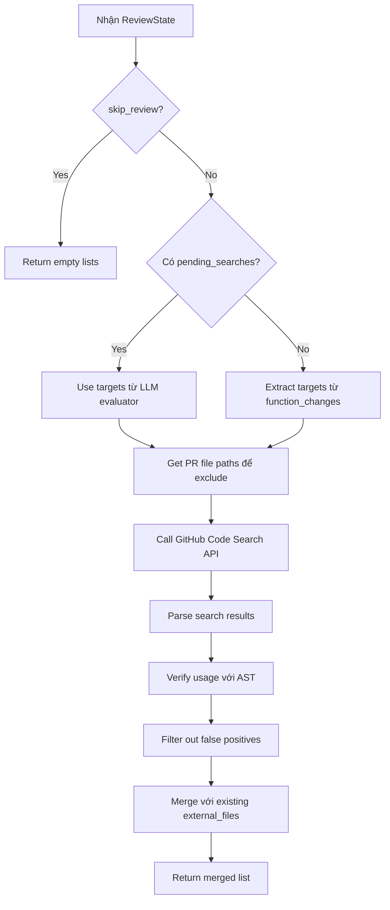
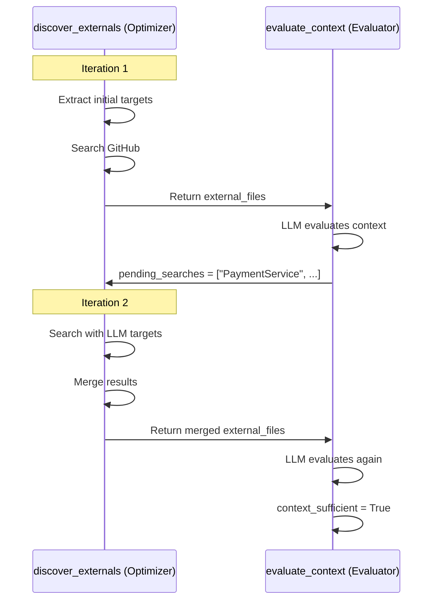

# Discover Externals Node

## 📋 Tổng quan

Node Phase 2.5a trong pipeline review, tìm kiếm các file external (ngoài PR) có phụ thuộc vào code đã thay đổi sử dụng GitHub Code Search API.

**Đặc điểm:** Node này là "optimizer" trong pattern evaluator-optimizer, thực hiện search dựa trên targets từ LLM evaluator.

---

## 🎯 Chức năng chính

1. **Search external files** - Tìm files ngoài PR reference đến changed code
2. **Verify usage with AST** - Xác nhận việc sử dụng thông qua AST analysis
3. **Return discovered files** - Trả về danh sách files để LLM đánh giá
4. **Support iterative discovery** - Hỗ trợ search lặp dựa trên feedback từ LLM

---

## 📥 Input (State)

Node nhận vào `ReviewState` với các trường:

| Field | Type | Mô tả |
|-------|------|-------|
| `pr_context` | `PRContext` | Thông tin về PR |
| `file_diffs` | `list[FileDiff]` | Các file trong PR (để exclude khỏi search) |
| `function_changes` | `dict[str, dict]` | Functions đã thay đổi (initial iteration) |
| `pending_searches` | `list[str]` | Search targets từ LLM evaluator (subsequent iterations) |
| `evaluation_iteration` | `int` | Số lần iteration hiện tại |
| `external_files` | `list[ExternalFile]` | Files đã discover (để merge) |
| `skip_review` | `bool` | Flag để skip |

---

## 📤 Output (State Updates)

Node trả về dict cập nhật state với:

| Field | Type | Mô tả |
|-------|------|-------|
| `external_files` | `list[ExternalFile]` | Danh sách files external đã discover (merged) |
| `pending_searches` | `list[str]` | Clear về [] sau khi search xong |

### ExternalFile structure:
```python
@dataclass
class ExternalFile:
    path: str              # Đường dẫn file
    content: str           # Nội dung file
    usage_type: str        # Loại usage: "import", "call", "reference"
    references: list[str]  # Danh sách symbols được reference
    will_break: bool       # File này có bị break không
    break_reason: str      # Lý do break (nếu có)
    affected_lines: list[int]  # Các dòng bị ảnh hưởng
```

---

## 🔄 Quy trình xử lý



---

## 🛠️ Công nghệ sử dụng

### Dependencies:
- **ExternalDiscoveryService** (`analysis.external_discovery`): Service tìm external files
- **GitHubService** (`app.services.github`): Gọi GitHub Code Search API
- **AST Analyzer**: Verify actual usage trong code

### Search Strategy:

#### Initial Iteration (iteration = 0):
```python
# Extract từ function_changes
changed_classes = ["User", "Payment", "Order"]
changed_methods = ["create_user", "process_payment", "calculate_total"]
```

#### Subsequent Iterations (iteration > 0):
```python
# Use targets từ LLM evaluator
pending_searches = ["PaymentService", "OrderValidator", "EmailNotifier"]
```

---

## 🌐 API Calls

### GitHub Code Search API:

**Endpoint**: `GET /search/code`

**Query format**:
```
repo:{owner}/{repo} {search_term}
```

**Examples**:
```bash
# Search for class usage
"repo:myorg/myrepo User"

# Search for method calls
"repo:myorg/myrepo create_user"

# Search for imports
"repo:myorg/myrepo from models import User"
```

**Input**:
- `owner`: Repository owner
- `repo`: Repository name
- `changed_classes`: List class names cần search
- `changed_methods`: List method names cần search
- `exclude_paths`: Paths in PR (không search)

**Output**:
```python
{
    "total_count": 15,
    "items": [
        {
            "path": "src/api/checkout.py",
            "repository": {...},
            "text_matches": [
                {
                    "fragment": "user = create_user(name)",
                    "matches": [...]
                }
            ]
        },
        # ... more results
    ]
}
```

---

## ⚙️ Evaluator-Optimizer Pattern

Node này implement phần "Optimizer" trong pattern:



### Loop điều kiện:
- **Max iterations**: 3
- **Continue if**: LLM says "need more context" và có pending_searches
- **Stop if**: context_sufficient = True hoặc max iterations

---

## 📊 Logging & Metrics

```python
# Initial iteration
log.info("discover_externals.initial",
    owner=ctx.owner,
    repo=ctx.repo,
    changed_classes=changed_classes[:5],
    changed_methods_count=len(changed_methods),
)

# From evaluator
log.info("discover_externals.from_evaluator",
    owner=ctx.owner,
    repo=ctx.repo,
    iteration=iteration,
    targets=pending_searches[:10],
)

# Complete
log.info("discover_externals.complete",
    iteration=iteration,
    new_files=len(new_external_files),
    total_files=len(merged_external_files),
)
```

---

## 🔍 Chi tiết kỹ thuật

### Extract search targets:

```python
def _extract_search_targets(state):
    changed_classes = set()
    changed_methods = []
    
    for func_name, change_info in function_changes.items():
        # Extract class name from file path
        # e.g., "src/models/user.py" → "User"
        func_def = change_info.get("new") or change_info.get("old")
        if func_def:
            file_path = func_def.file_path
            class_name = extract_class_name(file_path)
            changed_classes.add(class_name)
        
        # Add method name
        changed_methods.append(func_name)
    
    return list(changed_classes), changed_methods
```

### Merge with existing:

```python
# Avoid duplicates
existing_paths = {f.path for f in existing_external_files}

merged = list(existing_external_files)
for ext_file in new_external_files:
    if ext_file.path not in existing_paths:
        merged.append(ext_file)
        existing_paths.add(ext_file.path)
```

---

## ⚡ Performance

### Optimization strategies:

1. **Exclude PR files**: Không search trong files đã có trong PR
2. **Limit results**: GitHub API limit 100 results/query
3. **Batch searches**: Group multiple terms trong một query
4. **Cache results**: Avoid duplicate searches trong iterations

### Rate limits:
- **Authenticated**: 5,000 requests/hour
- **Search API**: 30 requests/minute
- Node này thường use 1-5 requests/PR

---

## 🚨 Error Handling

```python
# Skip if no data
if state.get("skip_review"):
    return {
        "external_files": [],
        "pending_searches": [],
    }

# GitHub API errors
try:
    new_external_files = await discovery.discover(...)
except GitHubSearchError as e:
    log.error("discover_externals.search_failed", error=str(e))
    # Return existing files, don't fail completely
    return {
        "external_files": existing_external_files,
        "pending_searches": [],
    }
```

---

## 🔗 Next Node

Sau node này, flow đi đến:
- **evaluate_context** (Phase 2.5b) - LLM đánh giá context đủ chưa

Conditional routing:
```python
if context_sufficient:
    → route_review (Phase 3a)
elif iteration < MAX_ITERATIONS and pending_searches:
    → discover_externals (loop back)
else:
    → route_review (max iterations reached)
```

---

## 📝 Example

### Input state (Initial):
```python
{
    "pr_context": {...},
    "file_diffs": [
        FileDiff(file_path="src/models/user.py", ...)
    ],
    "function_changes": {
        "create_user": {
            "type": "modified",
            "new": FunctionDef(name="create_user", file_path="src/models/user.py")
        }
    },
    "pending_searches": [],  # Empty - initial iteration
    "evaluation_iteration": 0,
    "external_files": []
}
```

### Output state (Initial):
```python
{
    "external_files": [
        ExternalFile(
            path="src/api/users_api.py",
            content="def handle_create():\n    user = create_user(name)\n",
            usage_type="call",
            references=["create_user"],
            will_break=True,
            break_reason="Signature changed: added required param 'email'",
            affected_lines=[15]
        ),
        ExternalFile(
            path="src/services/auth_service.py",
            content="from models import User\n",
            usage_type="import",
            references=["User"],
            will_break=False,
            break_reason=None,
            affected_lines=[]
        )
    ],
    "pending_searches": []  # Cleared after search
}
```

### Input state (Iteration 2 - từ LLM):
```python
{
    # ... same as above ...
    "pending_searches": ["PaymentService", "OrderValidator"],
    "evaluation_iteration": 1,
    "external_files": [...]  # From iteration 1
}
```

### Output state (Iteration 2):
```python
{
    "external_files": [
        # ... files from iteration 1 ...
        ExternalFile(
            path="src/services/payment_service.py",
            content="...",
            usage_type="call",
            references=["create_user", "validate_payment"],
            will_break=True,
            ...
        )
    ],
    "pending_searches": []
}
```

---

## 💡 Best Practices

### Search targets:
- **Be specific**: Search for class/method names, không search generic terms
- **Limit scope**: Chỉ search trong repo hiện tại
- **Exclude obvious**: Bỏ qua test files, generated files

### AST Verification:
- **Verify actual usage**: Không chỉ dựa vào text search
- **Check import statements**: Confirm imports are actually used
- **Analyze call sites**: Xác định chính xác cách function được gọi
