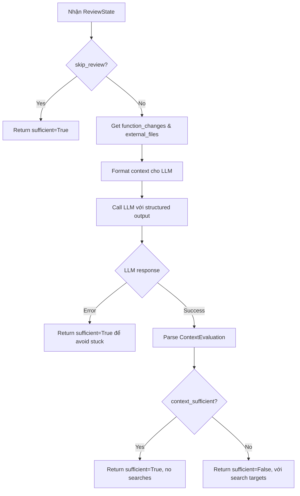
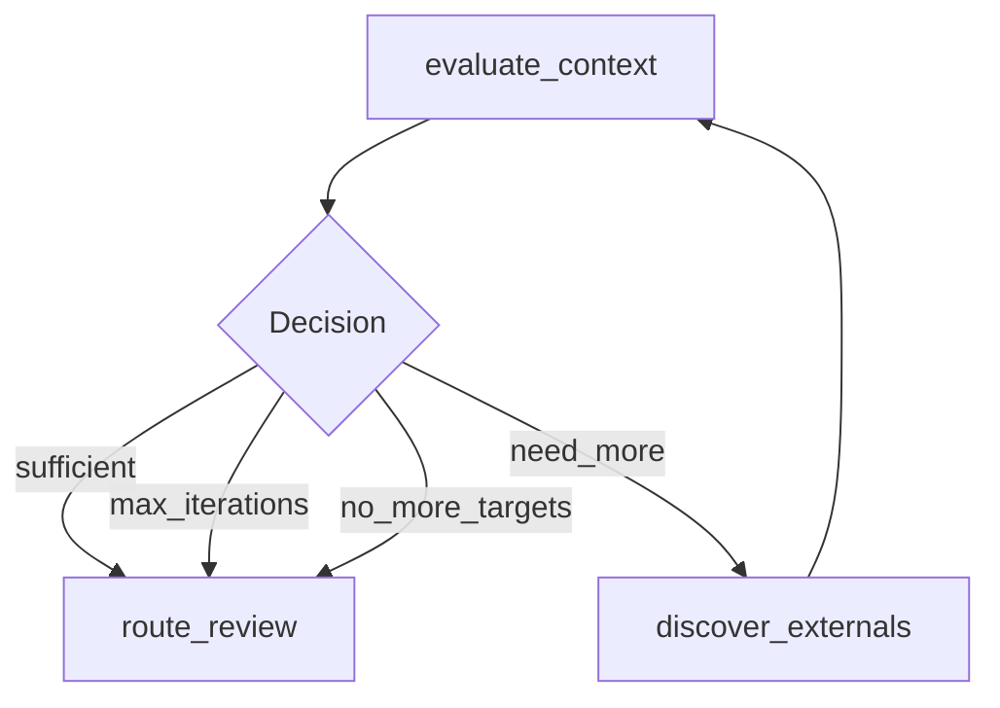

# Evaluate Context Node

## 📋 Tổng quan

Node Phase 2.5b trong pipeline review, sử dụng LLM để đánh giá xem context hiện tại có đủ để review chính xác không.

**Đặc điểm:** Node này là "evaluator" trong pattern evaluator-optimizer, sử dụng LLM để quyết định có cần thêm context.

---

## 🎯 Chức năng chính

1. **Analyze current context** - Phân tích changed code và external files hiện có
2. **Determine sufficiency** - LLM quyết định context đã đủ chưa
3. **Suggest additional searches** - Đề xuất classes/services cần tìm thêm
4. **Track iteration count** - Đếm số lần đã loop

---

## 📥 Input (State)

Node nhận vào `ReviewState` với các trường:

| Field | Type | Mô tả |
|-------|------|-------|
| `function_changes` | `dict[str, dict]` | Functions đã thay đổi |
| `external_files` | `list[ExternalFile]` | Files external đã discover |
| `evaluation_iteration` | `int` | Số lần iteration hiện tại |
| `skip_review` | `bool` | Flag để skip |

---

## 📤 Output (State Updates)

Node trả về dict cập nhật state với:

| Field | Type | Mô tả |
|-------|------|-------|
| `context_sufficient` | `bool` | Context đã đủ chưa |
| `pending_searches` | `list[str]` | Danh sách classes/services cần search thêm |
| `evaluation_iteration` | `int` | Iteration count + 1 |

---

## 🔄 Quy trình xử lý



---

## 🛠️ Công nghệ sử dụng

### Dependencies:
- **LLM Client** (`core.llm`): Get configured LLM (Claude/GPT)
- **ContextEvaluation Model** (`agents.models`): Pydantic model cho structured output
- **Prompt Template** (`agents.prompts.context_evaluation`): Prompt cho LLM

---

## 🤖 LLM Integration

### Structured Output Model:

```python
class ContextEvaluation(BaseModel):
    """LLM evaluation response."""
    
    context_sufficient: bool = Field(
        description="Is the context sufficient for accurate review?"
    )
    
    confidence: float = Field(
        ge=0.0,
        le=1.0,
        description="Confidence level (0-1)"
    )
    
    reasoning: str = Field(
        description="Explanation of the decision"
    )
    
    need_more_context_for: list[str] = Field(
        default=[],
        description="List of classes/services to search for"
    )
```

### Prompt Format:

```markdown
## Changed Code

### Function: create_user
- **File**: src/models/user.py
- **Change Type**: modified
- **Impact**: signature changed

**Old Code**:
```python
def create_user(name):
    return User(name)
```

**New Code**:
```python
def create_user(name, email):
    return User(name, email)
```

## External Files Found

### File: src/api/users_api.py
- **Usage Type**: call
- **References**: create_user
- **Will Break**: True
- **Reason**: Missing required param 'email'

---

**Question**: Based on the changed code and external files found, do we have sufficient context to perform an accurate code review?

Consider:
1. Are there other files/classes that might be affected?
2. Do we need to see more callers or dependencies?
3. Are there services/validators that should be checked?

Return JSON with your evaluation.
```

---

## 🌐 API Calls

### LLM API:

**Provider**: Claude (Anthropic) hoặc GPT (OpenAI)

**Request**:
```python
llm = get_llm().with_structured_output(ContextEvaluation)

evaluation = await llm.ainvoke(
    EVALUATE_CONTEXT_PROMPT.format(
        changed_code=formatted_changes,
        external_files=formatted_externals,
    )
)
```

**Response**:
```python
ContextEvaluation(
    context_sufficient=False,
    confidence=0.8,
    reasoning="Need to check PaymentService and OrderValidator",
    need_more_context_for=["PaymentService", "OrderValidator"]
)
```

---

## ⚙️ Conditional Routing

Node này kết hợp với `should_continue()` function để routing:

```python
def should_continue(state: ReviewState) -> str:
    """Determine next step."""
    
    # Context đủ → proceed to review
    if state.get("context_sufficient"):
        return "sufficient"
    
    # Đã max iterations → proceed anyway
    iteration = state.get("evaluation_iteration", 0)
    if iteration >= MAX_ENRICHMENT_ITERATIONS:  # 3
        return "max_iterations"
    
    # LLM không có suggestions → proceed
    pending_searches = state.get("pending_searches", [])
    if not pending_searches:
        return "no_more_targets"
    
    # Continue discovering
    return "need_more"
```

### Routing flow:



---

## 📊 Logging & Metrics

```python
# Start
log.info("evaluate_context.started",
    iteration=iteration,
    external_files_count=len(external_files),
    functions_changed=len(function_changes),
)

# LLM response
log.info("evaluate_context.complete",
    iteration=iteration,
    sufficient=evaluation.context_sufficient,
    confidence=evaluation.confidence,
    need_more_count=len(evaluation.need_more_context_for),
    need_more=evaluation.need_more_context_for[:5],
    reasoning=evaluation.reasoning[:200],
)

# Error case
log.error("evaluate_context.error",
    iteration=iteration,
    error=str(e),
)

# Routing decision
log.info("evaluate_context.routing",
    decision="need_more" | "sufficient" | "max_iterations" | "no_more_targets",
    iteration=iteration,
)
```

---

## 🔍 Chi tiết kỹ thuật

### Format Changed Code:

```python
def format_changed_code(function_changes):
    lines = []
    for func_name, change in function_changes.items():
        lines.append(f"### Function: {func_name}")
        lines.append(f"- **File**: {change.file_path}")
        lines.append(f"- **Change Type**: {change.type}")
        
        if change.old_code:
            lines.append("**Old Code**:")
            lines.append(f"```\n{change.old_code}\n```")
        
        if change.new_code:
            lines.append("**New Code**:")
            lines.append(f"```\n{change.new_code}\n```")
    
    return "\n".join(lines)
```

### Format External Files:

```python
def format_external_files(external_files):
    if not external_files:
        return "No external files found yet."
    
    lines = []
    for f in external_files[:10]:  # Limit to 10
        lines.append(f"### File: {f.path}")
        lines.append(f"- **Usage Type**: {f.usage_type}")
        lines.append(f"- **References**: {', '.join(f.references)}")
        if f.will_break:
            lines.append(f"- **Will Break**: Yes")
            lines.append(f"- **Reason**: {f.break_reason}")
    
    return "\n".join(lines)
```

---

## ⚡ Performance

### LLM call optimization:

1. **Structured output**: Dùng Pydantic model → fast parsing
2. **Limit context size**: Chỉ gửi top 10 external files
3. **Truncate code**: Limit function code length
4. **Cache prompts**: Reuse prompt templates

### Typical response time:
- **Claude 3.5 Sonnet**: 2-4 seconds
- **GPT-4**: 3-5 seconds
- **GPT-3.5**: 1-2 seconds

---

## 🚨 Error Handling

```python
try:
    evaluation = await llm.ainvoke(prompt)
    
    return {
        "context_sufficient": evaluation.context_sufficient,
        "pending_searches": evaluation.need_more_context_for,
        "evaluation_iteration": iteration,
    }

except Exception as e:
    log.error("evaluate_context.error", error=str(e))
    
    # On error, assume sufficient để avoid stuck
    return {
        "context_sufficient": True,
        "pending_searches": [],
        "evaluation_iteration": iteration,
    }
```

**Fallback strategy**: Nếu LLM fail, assume context sufficient và proceed to review. Better to review với context hiện tại hơn là stuck.

---

## 🔗 Next Node

Sau node này, based on routing:

1. **sufficient** → `route_review` (Phase 3a)
2. **need_more** → `discover_externals` (loop back to Phase 2.5a)
3. **max_iterations** → `route_review` (forced proceed)
4. **no_more_targets** → `route_review` (LLM không có suggestions)

---

## 📝 Example

### Input state (Iteration 1):
```python
{
    "function_changes": {
        "create_user": {
            "type": "modified",
            "file_path": "src/models/user.py",
            "old_code": "def create_user(name):\n    return User(name)",
            "new_code": "def create_user(name, email):\n    return User(name, email)"
        }
    },
    "external_files": [
        ExternalFile(
            path="src/api/users_api.py",
            usage_type="call",
            references=["create_user"],
            will_break=True,
            break_reason="Missing param 'email'"
        )
    ],
    "evaluation_iteration": 0
}
```

### LLM Response:
```json
{
    "context_sufficient": false,
    "confidence": 0.75,
    "reasoning": "The create_user function is used in users_api.py, but we should also check PaymentService and OrderValidator which might create users during their flows.",
    "need_more_context_for": [
        "PaymentService",
        "OrderValidator",
        "RegistrationService"
    ]
}
```

### Output state:
```python
{
    "context_sufficient": False,
    "pending_searches": [
        "PaymentService",
        "OrderValidator",
        "RegistrationService"
    ],
    "evaluation_iteration": 1
}
```

**Next step**: Loop back to `discover_externals` với `pending_searches`

---

### Input state (Iteration 2 - after more discovery):
```python
{
    "function_changes": {...},  # Same
    "external_files": [
        # ... 3 files from before ...
        ExternalFile(path="src/services/payment_service.py", ...),
        ExternalFile(path="src/validators/order_validator.py", ...)
    ],
    "evaluation_iteration": 1
}
```

### LLM Response:
```json
{
    "context_sufficient": true,
    "confidence": 0.9,
    "reasoning": "We now have coverage of the main callers (users_api, PaymentService, OrderValidator). These are the critical paths that use create_user.",
    "need_more_context_for": []
}
```

### Output state:
```python
{
    "context_sufficient": True,
    "pending_searches": [],
    "evaluation_iteration": 2
}
```

**Next step**: Proceed to `route_review`

---

## 💡 LLM Prompting Best Practices

### What makes a good evaluation:

1. **Balance thoroughness vs. diminishing returns**: Không cần 100% coverage
2. **Focus on high-impact areas**: Priority cho critical paths
3. **Consider change complexity**: Simple changes cần ít context hơn
4. **Time constraints**: Max 3 iterations

### Example LLM reasoning:

**Good** ✅:
> "We have the main API caller and the payment service. These cover the critical paths. Other usage is likely in admin/reporting which is low priority."

**Bad** ❌:
> "We should find every single file that might import this module."

**Good** ✅:
> "PaymentService is likely impacted since users are created during checkout. We should verify."

**Bad** ❌:
> "Maybe there's something somewhere that uses this."
