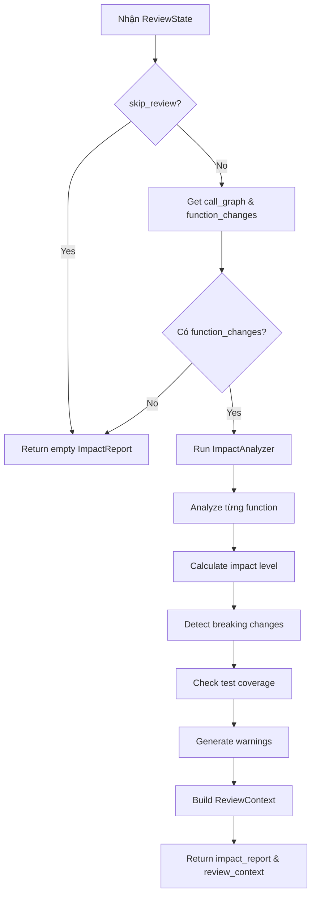

# Analyze Impact Node

## 📋 Tổng quan

Node Phase 2b trong pipeline review, xác định mức độ impact của các thay đổi code sử dụng call graph và AST analysis.

**Đặc điểm:** Node này hoàn toàn deterministic (không dùng LLM), thuần phân tích dựa trên data structures.

---

## 🎯 Chức năng chính

1. **Determine impact level** - Xác định mức độ impact cho mỗi function (CRITICAL, HIGH, MEDIUM, LOW, TRIVIAL)
2. **Identify breaking changes** - Detect các thay đổi breaking compatibility
3. **Check test coverage** - Kiểm tra test coverage của changed code
4. **Generate warnings** - Tạo warnings về potential issues
5. **Build review context** - Xây dựng context chi tiết cho review

---

## 📥 Input (State)

Node nhận vào `ReviewState` với các trường:

| Field | Type | Mô tả |
|-------|------|-------|
| `pr_context` | `PRContext` | Thông tin về PR |
| `file_diffs` | `list[FileDiff]` | Các file diff |
| `call_graph` | `CallGraph` | Call graph đã build |
| `function_changes` | `dict[str, dict]` | Functions đã thay đổi |
| `file_contents` | `dict[str, str]` | File contents |
| `skip_review` | `bool` | Flag để skip |

---

## 📤 Output (State Updates)

Node trả về dict cập nhật state với:

| Field | Type | Mô tả |
|-------|------|-------|
| `impact_report` | `ImpactReport` | Báo cáo impact chi tiết |
| `review_context` | `ReviewContext` | Context cho review process |

### ImpactReport structure:
```python
@dataclass
class ImpactReport:
    functions: list[FunctionImpact]      # Impact của từng function
    breaking_changes: list[str]          # Danh sách breaking changes
    warnings: list[ImpactWarning]        # Warnings về potential issues
    high_impact_functions: list[str]     # Functions có impact cao
```

### FunctionImpact:
```python
@dataclass
class FunctionImpact:
    name: str                    # Tên function
    file_path: str               # File chứa function
    impact_level: ImpactLevel    # CRITICAL, HIGH, MEDIUM, LOW, TRIVIAL
    signature_changed: bool      # Signature có đổi không
    caller_count: int            # Số functions gọi function này
    callee_count: int            # Số functions được function này gọi
    is_public_api: bool          # Có phải public API không
    has_tests: bool              # Có tests không
    warnings: list[ImpactWarning]  # Warnings specific cho function này
```

### ImpactLevel enum:
```python
class ImpactLevel(Enum):
    CRITICAL = "critical"    # Breaking changes, public APIs
    HIGH = "high"            # Many callers, signature changes
    MEDIUM = "medium"        # Some callers, behavior changes
    LOW = "low"              # Few callers, minor changes
    TRIVIAL = "trivial"      # No callers, cosmetic changes
```

### ReviewContext:
```python
@dataclass
class ReviewContext:
    functions: list[FunctionContext]  # Context chi tiết cho mỗi function
    summary: str                      # Summary của changes
```

---

## 🔄 Quy trình xử lý



---

## 🛠️ Công nghệ sử dụng

### Dependencies:
- **ImpactAnalyzer** (`analysis.impact_analyzer`): Core analyzer
- **ContextBuilder** (`analysis.context_builder`): Build review context
- **CallGraph** (`analysis.call_graph`): Call relationships

---

## 🔍 Impact Level Determination

### Algorithm:

```python
def calculate_impact_level(function_impact):
    # Critical: Breaking changes in public APIs
    if is_breaking_change and is_public_api:
        return ImpactLevel.CRITICAL
    
    # Critical: Many callers with signature change
    if caller_count > 10 and signature_changed:
        return ImpactLevel.CRITICAL
    
    # High: Signature change with some callers
    if signature_changed and caller_count > 0:
        return ImpactLevel.HIGH
    
    # High: Many callers without signature change
    if caller_count > 5:
        return ImpactLevel.HIGH
    
    # Medium: Some callers
    if caller_count > 0:
        return ImpactLevel.MEDIUM
    
    # Low: New function or no callers
    if is_new_function or caller_count == 0:
        return ImpactLevel.LOW
    
    # Trivial: Cosmetic changes
    return ImpactLevel.TRIVIAL
```

### Factors considered:

1. **Signature changes**: Parameters added/removed/changed
2. **Caller count**: Số functions gọi function này
3. **Public API**: Function có exported/public không
4. **Breaking changes**: Backward compatibility bị break
5. **Test coverage**: Có tests cho function không

---

## 🚨 Breaking Change Detection

### Types of breaking changes:

1. **Signature changes**:
   ```python
   # BREAKING: Added required param
   - def create_user(name):
   + def create_user(name, email):
   
   # BREAKING: Removed param
   - def create_user(name, email):
   + def create_user(name):
   
   # BREAKING: Changed param type
   - def calculate(amount: int):
   + def calculate(amount: float):
   
   # OK: Added optional param
   - def create_user(name):
   + def create_user(name, email=None):
   ```

2. **Return type changes**:
   ```python
   # BREAKING: Changed return type
   - def get_user() -> User:
   + def get_user() -> Optional[User]:
   ```

3. **Exception changes**:
   ```python
   # BREAKING: New exception thrown
   + raise ValueError("Invalid email")
   ```

---

## 📊 Impact Warnings

### Warning types:

```python
class WarningType(Enum):
    BREAKING_SIGNATURE = "breaking_signature"
    MANY_CALLERS = "many_callers"
    NO_TESTS = "no_tests"
    PUBLIC_API_CHANGE = "public_api_change"
    COMPLEX_LOGIC_CHANGE = "complex_logic_change"
```

### Example warnings:

```python
[
    ImpactWarning(
        warning_type=WarningType.BREAKING_SIGNATURE,
        message="Function signature changed with 5 existing callers",
        severity="critical"
    ),
    ImpactWarning(
        warning_type=WarningType.NO_TESTS,
        message="No tests found for this critical function",
        severity="warning"
    )
]
```

---

## 🧪 Test Coverage Analysis

### Detection methods:

1. **Test file patterns**:
   ```python
   test_patterns = [
       "test_{function_name}.py",
       "{function_name}_test.py",
       "test_*.py" (contains function_name)
   ]
   ```

2. **Test function patterns**:
   ```python
   test_function_patterns = [
       "test_{function_name}",
       "test_{function_name}_*",
       "{function_name}_test"
   ]
   ```

3. **Search in call graph**:
   ```python
   has_tests = any(
       caller.startswith("test_") 
       for caller in call_graph.get_callers(function_name)
   )
   ```

---

## 📊 Logging & Metrics

```python
# Start
log.info("analyze_impact.started",
    functions=len(function_changes),
    files=len(diffs),
)

# Complete
log.info("analyze_impact.complete",
    functions_analyzed=len(report.functions),
    breaking_changes=len(report.breaking_changes),
    warnings=len(report.warnings),
    high_impact=len(report.high_impact_functions),
)
```

---

## 🔍 Chi tiết kỹ thuật

### ImpactAnalyzer workflow:

```python
class ImpactAnalyzer:
    def analyze(self, diffs, call_graph, function_changes):
        impacts = []
        
        for func_name, change in function_changes.items():
            # Get call relationships
            callers = call_graph.get_callers(func_name)
            callees = call_graph.get_callees(func_name)
            
            # Detect signature change
            signature_changed = self._check_signature_change(
                change.old_signature,
                change.new_signature
            )
            
            # Calculate impact level
            impact_level = self._calculate_impact_level(
                caller_count=len(callers),
                signature_changed=signature_changed,
                is_public=self._is_public_api(func_name),
            )
            
            # Check tests
            has_tests = self._check_test_coverage(func_name, callers)
            
            # Generate warnings
            warnings = self._generate_warnings(
                func_name,
                impact_level,
                signature_changed,
                len(callers),
                has_tests
            )
            
            impacts.append(FunctionImpact(
                name=func_name,
                impact_level=impact_level,
                signature_changed=signature_changed,
                caller_count=len(callers),
                has_tests=has_tests,
                warnings=warnings
            ))
        
        return ImpactReport(
            functions=impacts,
            breaking_changes=self._find_breaking_changes(impacts),
            high_impact_functions=[
                f.name for f in impacts 
                if f.impact_level in [ImpactLevel.CRITICAL, ImpactLevel.HIGH]
            ]
        )
```

---

## ⚡ Performance

- **In-memory analysis**: Tất cả data đã có trong memory
- **O(n) complexity**: n = số functions changed
- **Fast execution**: ~10-50ms cho typical PR

---

## 🚨 Error Handling

```python
# No function changes
if not function_changes:
    log.info("analyze_impact.skipped", reason="no_function_changes")
    return {"impact_report": ImpactReport()}

# Missing call graph
if not call_graph:
    log.warning("analyze_impact.no_call_graph")
    # Continue with partial analysis
    caller_count = 0  # Unknown
```

---

## 🔗 Next Node

Sau node này, state được chuyển đến:
- **route_review** (Phase 3a) - Route functions to appropriate review depth

---

## 📝 Example

### Input state:
```python
{
    "pr_context": {...},
    "file_diffs": [FileDiff(...)],
    "call_graph": CallGraph(
        relations={
            "create_user": CallRelation(
                callers=[
                    CallerInfo(caller="handle_signup", ...),
                    CallerInfo(caller="admin_create", ...),
                    CallerInfo(caller="test_create_user", ...)
                ],
                callees=[
                    CalleeInfo(name="validate_email", ...),
                    CalleeInfo(name="hash_password", ...)
                ]
            )
        }
    ),
    "function_changes": {
        "create_user": {
            "type": "modified",
            "old": FunctionDef(
                signature="def create_user(name)",
                ...
            ),
            "new": FunctionDef(
                signature="def create_user(name, email)",
                ...
            )
        }
    }
}
```

### Output state:
```python
{
    "impact_report": ImpactReport(
        functions=[
            FunctionImpact(
                name="create_user",
                file_path="src/models/user.py",
                impact_level=ImpactLevel.HIGH,
                signature_changed=True,
                caller_count=3,
                callee_count=2,
                is_public_api=True,
                has_tests=True,
                warnings=[
                    ImpactWarning(
                        warning_type=WarningType.BREAKING_SIGNATURE,
                        message="Signature changed: added required param 'email'",
                        severity="critical"
                    )
                ]
            )
        ],
        breaking_changes=[
            "create_user: Added required parameter 'email' (2 non-test callers affected)"
        ],
        warnings=[...],
        high_impact_functions=["create_user"]
    ),
    "review_context": ReviewContext(
        functions=[
            FunctionContext(
                name="create_user",
                impact_level=ImpactLevel.HIGH,
                callers=[...],
                callees=[...],
                review_questions=[
                    "Are all callers updated to pass the new 'email' parameter?",
                    "Is input validation adequate for the new parameter?",
                    "Are tests updated to cover the new behavior?"
                ]
            )
        ]
    )
}
```

---

## 💡 Best Practices

### Accurate impact assessment:

1. **Consider context**: Public APIs need stricter review
2. **Check test coverage**: Untested code = higher risk
3. **Track callers**: More callers = higher impact
4. **Detect breaking changes early**: Before merge

### False positives/negatives:

**False HIGH impact**:
- Internal refactoring with callers updated
- Backward-compatible signature changes

**False LOW impact**:
- Changes in rarely-called but critical paths
- Changes in error handling code

### Mitigation:
- LLM review can override impact level if needed
- Human reviewer has final say
