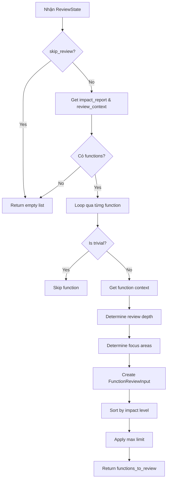

# Route Review Node

## 📋 Tổng quan

Node Phase 3a trong pipeline review, routing functions đến appropriate review depth dựa trên impact analysis.

**Đặc điểm:** Node này deterministic với minimal LLM (hoặc pure heuristics), chủ yếu là business logic.

---

## 🎯 Chức năng chính

1. **Filter trivial changes** - Loại bỏ thay đổi quá đơn giản không cần review
2. **Determine review depth** - Xác định độ sâu review (quick, standard, deep)
3. **Prioritize high-impact** - Ưu tiên các changes có impact cao
4. **Set focus areas** - Xác định areas cần focus khi review

---

## 📥 Input (State)

Node nhận vào `ReviewState` với các trường:

| Field | Type | Mô tả |
|-------|------|-------|
| `impact_report` | `ImpactReport` | Báo cáo impact từ node trước |
| `review_context` | `ReviewContext` | Context chi tiết cho review |
| `repo_config` | `ReviewerConfig` | Config của repository |
| `skip_review` | `bool` | Flag để skip |

---

## 📤 Output (State Updates)

Node trả về dict cập nhật state với:

| Field | Type | Mô tả |
|-------|------|-------|
| `functions_to_review` | `list[FunctionReviewInput]` | Danh sách functions cần review |

### FunctionReviewInput structure:
```python
@dataclass
class FunctionReviewInput:
    function_context: FunctionContext    # Context chi tiết của function
    review_depth: str                    # "quick", "standard", "deep"
    focus_areas: list[str]               # Areas cần focus
```

### FunctionContext:
```python
@dataclass
class FunctionContext:
    name: str
    file_path: str
    change_type: ChangeType              # "added", "modified", "deleted"
    impact_level: ImpactLevel            # CRITICAL, HIGH, MEDIUM, LOW
    old_code: str
    new_code: str
    diff: str
    callers: list[CallerInfo]
    callees: list[CalleeInfo]
    review_questions: list[str]          # Suggested questions
```

---

## 🔄 Quy trình xử lý



---

## 🛠️ Công nghệ sử dụng

### Dependencies:
- **ImpactReport/ImpactLevel** (`analysis.impact_analyzer`)
- **ReviewerConfig** (`core.config`)

---

## 🔍 Chi tiết kỹ thuật

### 1. Trivial Change Detection

```python
def _is_trivial_change(impact: FunctionImpact) -> bool:
    """Detect trivial changes that don't need review."""
    
    match impact.impact_level:
        case ImpactLevel.TRIVIAL:
            # Explicitly marked as trivial
            return True
        
        case ImpactLevel.LOW if not impact.signature_changed:
            # Low impact without signature change
            # BUT: Only skip if call graph confirms no callers
            # If caller_count=0 due to missing data, DON'T skip
            return False  # Err on side of caution
        
        case _:
            return False
```

**Examples of trivial changes**:
- Formatting/whitespace changes
- Comment updates
- Variable renames (internal)
- Cosmetic refactoring

**NOT trivial**:
- Logic changes
- Signature changes
- New code paths
- Error handling changes

---

### 2. Review Depth Determination

```python
def _determine_review_depth(impact: FunctionImpact) -> str:
    """Determine appropriate review depth."""
    
    match impact.impact_level:
        case ImpactLevel.CRITICAL:
            return "deep"
        
        case ImpactLevel.HIGH:
            # Deep nếu signature changed, standard otherwise
            return "deep" if impact.signature_changed else "standard"
        
        case ImpactLevel.MEDIUM:
            return "standard"
        
        case _:
            return "quick"
```

#### Review Depth Levels:

| Level | Description | Prompt Complexity | Time |
|-------|-------------|-------------------|------|
| **deep** | Comprehensive review with full context | High | 10-20s |
| **standard** | Normal review with key context | Medium | 5-10s |
| **quick** | Fast check for obvious issues | Low | 2-5s |

---

### 3. Focus Areas Determination

```python
def _determine_focus_areas(impact: FunctionImpact) -> list[str]:
    """Determine focus areas based on impact."""
    
    areas = []
    
    # Signature changed → check compatibility
    if impact.signature_changed:
        areas.append("backward_compatibility")
    
    # Has callers → check caller impact
    if impact.caller_count > 0:
        areas.append("caller_impact")
    
    # Check warnings
    for warning in impact.warnings:
        match warning.warning_type:
            case WarningType.BREAKING_SIGNATURE:
                areas.append("breaking_changes")
            case WarningType.MANY_CALLERS:
                areas.append("api_stability")
            case WarningType.NO_TESTS:
                areas.append("test_coverage")
    
    return list(set(areas))  # Deduplicate
```

#### Available Focus Areas:

- **backward_compatibility**: Check breaking changes
- **caller_impact**: Verify callers still work
- **breaking_changes**: Identify breaking changes
- **api_stability**: Check API contract stability
- **test_coverage**: Verify test adequacy
- **error_handling**: Check error handling
- **input_validation**: Check input validation
- **performance**: Check performance implications
- **security**: Security review

---

### 4. Prioritization

Functions sorted by impact level:

```python
impact_order = {
    ImpactLevel.CRITICAL: 0,  # First
    ImpactLevel.HIGH: 1,
    ImpactLevel.MEDIUM: 2,
    ImpactLevel.LOW: 3,
    ImpactLevel.TRIVIAL: 4,   # Last (usually skipped)
}

functions_to_review.sort(
    key=lambda f: impact_order.get(f.function_context.impact_level, 99)
)
```

---

### 5. Limit Application

```python
# Config-based limit
max_functions = config.max_functions_to_review  # Default: 20

if len(functions_to_review) > max_functions:
    log.warning("route_review.truncated",
        original=len(functions_to_review),
        max=max_functions
    )
    functions_to_review = functions_to_review[:max_functions]
```

**Rationale**: 
- Too many functions → overwhelming review
- Better to review top N thoroughly
- LLM token limits
- Review time constraints

---

## 📊 Logging & Metrics

```python
# Start
log.info("route_review.started",
    total_functions=len(report.functions),
)

# Skipped trivial
log.debug("route_review.skipped_trivial",
    function=impact.name,
)

# Missing context
log.warning("route_review.missing_context",
    function=impact.name,
)

# Complete
log.info("route_review.complete",
    to_review=len(functions_to_review),
    skipped_trivial=skipped_trivial,
    deep_review=sum(1 for f in functions_to_review if f.review_depth == "deep"),
    standard_review=sum(1 for f in functions_to_review if f.review_depth == "standard"),
)
```

---

## ⚡ Performance

- **Fast execution**: Pure logic, no I/O
- **O(n) complexity**: n = số functions
- **Typical time**: < 10ms

---

## 🚨 Error Handling

```python
# No functions
if not report.functions:
    log.info("route_review.skipped", reason="no_functions")
    return {"functions_to_review": []}

# Missing context
func_context = func_contexts.get(impact.name)
if not func_context:
    log.warning("route_review.missing_context",
        function=impact.name
    )
    continue  # Skip this function
```

---

## 🔗 Next Node

Sau node này, state được chuyển đến:
- **review_function** (Phase 3b) - LLM-based review cho từng function

---

## 📝 Example

### Input state:
```python
{
    "impact_report": ImpactReport(
        functions=[
            FunctionImpact(
                name="create_user",
                impact_level=ImpactLevel.HIGH,
                signature_changed=True,
                caller_count=3,
                warnings=[
                    ImpactWarning(
                        warning_type=WarningType.BREAKING_SIGNATURE,
                        ...
                    )
                ]
            ),
            FunctionImpact(
                name="format_name",
                impact_level=ImpactLevel.LOW,
                signature_changed=False,
                caller_count=0,
                warnings=[]
            ),
            FunctionImpact(
                name="process_payment",
                impact_level=ImpactLevel.CRITICAL,
                signature_changed=False,
                caller_count=15,
                warnings=[
                    ImpactWarning(
                        warning_type=WarningType.MANY_CALLERS,
                        ...
                    )
                ]
            )
        ]
    ),
    "review_context": ReviewContext(
        functions=[
            FunctionContext(name="create_user", ...),
            FunctionContext(name="format_name", ...),
            FunctionContext(name="process_payment", ...)
        ]
    ),
    "repo_config": ReviewerConfig(max_functions_to_review=20)
}
```

### Output state:
```python
{
    "functions_to_review": [
        # CRITICAL first
        FunctionReviewInput(
            function_context=FunctionContext(
                name="process_payment",
                impact_level=ImpactLevel.CRITICAL,
                ...
            ),
            review_depth="deep",
            focus_areas=["api_stability", "caller_impact"]
        ),
        
        # HIGH second
        FunctionReviewInput(
            function_context=FunctionContext(
                name="create_user",
                impact_level=ImpactLevel.HIGH,
                ...
            ),
            review_depth="deep",
            focus_areas=["backward_compatibility", "breaking_changes"]
        ),
        
        # LOW skipped (trivial)
        # format_name was skipped
    ]
}
```

---

## 💡 Configuration Options

### ReviewerConfig:

```python
class ReviewerConfig(BaseModel):
    max_functions_to_review: int = 20
    review_trivial_changes: bool = False
    prioritize_public_apis: bool = True
    
    # Depth thresholds
    deep_review_threshold: int = 5      # callers
    standard_review_threshold: int = 2   # callers
```

### Customization examples:

```yaml
# .ai-reviewer.yml

reviews:
  max_functions: 30              # Review more functions
  review_trivial: true           # Don't skip trivial
  
  depth_rules:
    deep_threshold: 10           # Require 10+ callers for deep
    force_deep_if:
      - has_security_annotation
      - modifies_database
```

---

## 🎯 Decision Matrix

| Impact | Signature Changed | Caller Count | Review Depth | Focus Areas |
|--------|------------------|--------------|--------------|-------------|
| CRITICAL | Any | Any | **deep** | breaking_changes, api_stability |
| HIGH | Yes | > 0 | **deep** | backward_compatibility, caller_impact |
| HIGH | No | > 5 | **standard** | caller_impact |
| MEDIUM | Any | > 0 | **standard** | caller_impact |
| LOW | No | 0 | **quick** | basic_correctness |
| TRIVIAL | No | 0 | **skip** | - |

---

## 🔮 Future Enhancements

1. **ML-based routing**: Learn optimal depth from past reviews
2. **User feedback**: Adjust based on reviewer preferences
3. **Custom rules**: Per-file/per-directory routing rules
4. **Dynamic limits**: Adjust based on PR size and complexity
