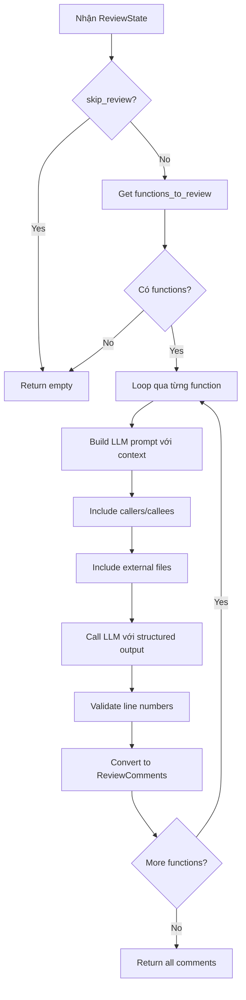

# Review Function Node

## 📋 Tổng quan

Node Phase 3b trong pipeline review, thực hiện review chi tiết từng function sử dụng LLM với targeted prompts.

**Đặc điểm:** Node này là core LLM-based review, nơi diễn ra actual code analysis bởi AI.

---

## 🎯 Chức năng chính

1. **Review each function** - Review từng function với context đầy đủ
2. **Include dependencies** - Cung cấp caller/callee context cho LLM
3. **Detect issues** - Tìm bugs, security issues, logic errors
4. **Generate suggestions** - Đề xuất fixes
5. **Validate findings** - Validate line numbers và findings

---

## 📥 Input (State)

Node nhận vào `ReviewState` với các trường:

| Field | Type | Mô tả |
|-------|------|-------|
| `functions_to_review` | `list[FunctionReviewInput]` | Functions cần review |
| `external_files` | `list[ExternalFile]` | External files context |
| `breaking_changes` | `list[str]` | Detected breaking changes |
| `skip_review` | `bool` | Flag để skip |

---

## 📤 Output (State Updates)

Node trả về dict cập nhật state với:

| Field | Type | Mô tả |
|-------|------|-------|
| `comments` | `list[ReviewComment]` | Review comments từ LLM |
| `review_failures` | `list[dict]` | Functions failed to review |

### ReviewComment structure:
```python
@dataclass
class ReviewComment:
    file: str                            # File path
    line: int                            # Line number
    severity: str                        # "critical", "warning", "info", "suggestion"
    category: str                        # "logic", "security", "performance", etc.
    message: str                         # Issue description
    suggestion: str | None               # Suggested fix
    confidence: float                    # 0.0 - 1.0
    agent: str                           # "function_reviewer"
    
    # Dependency context
    caller_refs: list[CodeRef]           # Callers affected
    dependency_refs: list[CodeRef]       # Dependencies analyzed
    affected_files: list[AffectedFile]   # External files affected
```

---

## 🔄 Quy trình xử lý



---

## 🛠️ Công nghệ sử dụng

### Dependencies:
- **LLM Client** (`core.llm`): Get configured LLM
- **AgentFindings Model** (`agents.models`): Structured output
- **Prompt Builder** (`agents.prompts.function_review`): Build prompts

---

## 🤖 LLM Integration

### Structured Output Model:

```python
class AgentFinding(BaseModel):
    """Single finding from code review."""
    
    line: int = Field(
        ...,
        description="Line number where issue found",
        ge=1
    )
    
    severity: Literal["critical", "warning", "info", "suggestion"]
    
    message: str = Field(
        ...,
        description="Clear description of the issue",
        min_length=10
    )
    
    suggestion: str | None = Field(
        None,
        description="Suggested fix (optional)"
    )
    
    confidence: float = Field(
        ...,
        description="Confidence level 0-1",
        ge=0.0,
        le=1.0
    )
    
    affected_files: list[str] = Field(
        default=[],
        description="Files affected (format: 'file.py:line')"
    )


class AgentFindings(BaseModel):
    """Collection of findings."""
    findings: list[AgentFinding]
```

---

## 📝 Prompt Building

### System Prompt:

```markdown
You are an expert code reviewer analyzing code changes.

Your task:
1. Review the changed function thoroughly
2. Consider dependencies (callers and callees)
3. Check for bugs, security issues, and logic errors
4. Verify compatibility with callers
5. Return findings as structured JSON

Focus on:
- Correctness and logic errors
- Security vulnerabilities
- Breaking changes
- Error handling
- Input validation
- Performance issues
```

### User Prompt Structure:

```markdown
## Function: {function_name}

**File**: {file_path}
**Change Type**: {change_type}
**Impact Level**: {impact_level}

### Old Code:
```{language}
{old_code}
```

### New Code:
```{language}
{new_code}
```

### Diff:
```diff
{diff}
```

### Callers (Functions that call this):
{callers_list}

### Callees (Functions called by this):
{callees_list}

### External Files Affected:
{external_files_list}

### Breaking Changes Detected:
{breaking_changes_list}

### Review Depth: {review_depth}

### Focus Areas: {focus_areas}

---

Please review this function and return findings in JSON format.
```

---

## 🔍 Context Details

### Callers Context:

```python
callers_data = [
    {
        "name": "handle_signup",
        "file": "src/api/auth.py",
        "line": 45,
        "context": "user = create_user(name)"
    },
    {
        "name": "admin_create",
        "file": "src/admin/users.py",
        "line": 120,
        "context": "user = create_user(form.name)"
    }
]
```

### Callees Context:

```python
callees_data = [
    {
        "name": "validate_email",
        "file_path": "src/validators.py",
        "signature": "def validate_email(email: str) -> bool",
        "source_code": "...",
        "has_validation": True,
        "returns_optional": False
    }
]
```

### External Files Context:

```python
external_files_data = [
    {
        "path": "src/services/payment_service.py",
        "usage_type": "call",
        "references": ["create_user"],
        "will_break": True,
        "break_reason": "Missing required param 'email'",
        "affected_lines": [234],
        "content": "# First 500 chars..."
    }
]
```

---

## 🌐 API Calls

### LLM API:

**Provider**: Claude 3.5 Sonnet hoặc GPT-4

**Request**:
```python
llm = get_llm().with_structured_output(AgentFindings)

result = await llm.ainvoke(full_prompt)
```

**Response**:
```json
{
    "findings": [
        {
            "line": 15,
            "severity": "critical",
            "message": "Function signature changed but callers in auth.py and users.py are not updated to pass the new 'email' parameter",
            "suggestion": "Update callers: create_user(name, email) or make email optional",
            "confidence": 0.95,
            "affected_files": [
                "src/api/auth.py:45",
                "src/admin/users.py:120"
            ]
        },
        {
            "line": 18,
            "severity": "warning",
            "message": "No input validation for 'email' parameter",
            "suggestion": "Add: if not email or '@' not in email: raise ValueError('Invalid email')",
            "confidence": 0.85,
            "affected_files": []
        }
    ]
}
```

---

## ✅ Line Number Validation

```python
def _validate_line_numbers(findings, function_context):
    """Validate LLM-returned line numbers."""
    
    if not function_context.new_code:
        return findings  # Can't validate
    
    code_lines = function_context.new_code.split('\n')
    max_line = len(code_lines)
    
    valid_findings = []
    
    for finding in findings.findings:
        # Check line >= 1
        if finding.line < 1:
            log.warning("Invalid line < 1", line=finding.line)
            continue
        
        # Check line not way beyond code
        if finding.line > max_line + 10:  # Allow some buffer
            log.warning("Invalid line beyond code", 
                line=finding.line, 
                max=max_line
            )
            continue
        
        valid_findings.append(finding)
    
    return AgentFindings(findings=valid_findings)
```

---

## 🔄 Convert to ReviewComment

```python
for finding in result.findings:
    # Parse affected_files
    caller_refs = []
    affected_files_list = []
    
    for affected in finding.affected_files:
        # Format: "file.py:45" or just "file.py"
        if ":" in affected:
            file_part, line_part = affected.rsplit(":", 1)
            line_num = int(line_part)
            
            # Check if it's a caller
            if any(c["file"] == file_part for c in callers_data):
                caller_refs.append(CodeRef(
                    file=file_part,
                    line=line_num,
                    name=get_caller_name(file_part),
                    break_reason="Incompatible with changes"
                ))
            else:
                # External file
                affected_files_list.append(AffectedFile(
                    path=file_part,
                    line=line_num,
                    break_reason="Uses changed code"
                ))
    
    # Build dependency refs from callees
    dependency_refs = [
        CodeRef(
            file=c.file_path,
            line=0,
            name=c.name,
            break_reason=None
        )
        for c in ctx.callees[:5]
    ]
    
    comments.append(ReviewComment(
        file=ctx.file_path,
        line=finding.line,
        severity=finding.severity,
        category="logic",
        message=finding.message,
        suggestion=finding.suggestion,
        confidence=finding.confidence,
        agent="function_reviewer",
        caller_refs=caller_refs,
        dependency_refs=dependency_refs,
        affected_files=affected_files_list,
    ))
```

---

## 📊 Logging & Metrics

```python
# Reviewing function
log.debug("review_function.reviewing",
    function=ctx.name,
    file=ctx.file_path,
    depth=review_input.review_depth,
)

# With dependencies
log.info("review_function.prompt_with_dependencies",
    function=ctx.name,
    callers_count=len(callers_data),
    callees_count=len(ctx.callees),
    prompt_preview=prompt[:2000],
)

# Complete
log.debug("review_function.complete",
    function=ctx.name,
    comments_count=len(comments),
)

# Error
log.error("review_function.llm_error",
    function=ctx.name,
    error=str(e),
)

# Overall
log.info("review_functions.complete",
    functions_reviewed=len(functions_to_review),
    total_comments=len(all_comments),
    failures=len(review_failures),
)
```

---

## ⚡ Performance

### Sequential vs Parallel:

Current: **Sequential** (one by one)
```python
for review_input in functions_to_review:
    comments = await review_single_function(review_input)
    all_comments.extend(comments)
```

Future: **Parallel** (with asyncio.gather)
```python
tasks = [
    review_single_function(review_input)
    for review_input in functions_to_review
]
all_comments_lists = await asyncio.gather(*tasks)
all_comments = [c for comments in all_comments_lists for c in comments]
```

### Typical timing:
- **Per function**: 5-15 seconds
- **5 functions sequential**: 25-75 seconds
- **5 functions parallel**: 10-20 seconds (limited by slowest)

---

## 🚨 Error Handling

```python
# Per-function errors
try:
    comments = await review_single_function(review_input)
    all_comments.extend(comments)
except Exception as e:
    # Track failure but continue
    failure_info = {
        "function": ctx.name,
        "file": ctx.file_path,
        "error": str(e),
        "impact_level": ctx.impact_level.value,
    }
    review_failures.append(failure_info)
    log.error("review_functions.function_failed",
        function=ctx.name,
        error=str(e)
    )

# LLM errors
try:
    result = await llm.ainvoke(full_prompt)
except LLMError as e:
    log.error("review_function.llm_error", error=str(e))
    return []  # Empty comments for this function
```

---

## 🔗 Next Node

Sau node này, state được chuyển đến:
- **aggregate** (Phase 4) - Aggregate và deduplicate comments

---

## 📝 Example

### Input state:
```python
{
    "functions_to_review": [
        FunctionReviewInput(
            function_context=FunctionContext(
                name="create_user",
                file_path="src/models/user.py",
                change_type=ChangeType.MODIFIED,
                impact_level=ImpactLevel.HIGH,
                old_code="def create_user(name):\n    return User(name)",
                new_code="def create_user(name, email):\n    return User(name, email)",
                diff="@@ -1,2 +1,2 @@\n-def create_user(name):\n+def create_user(name, email):",
                callers=[
                    CallerInfo(caller="handle_signup", file="auth.py", line=45, ...)
                ],
                callees=[
                    CalleeInfo(name="User", ...)
                ]
            ),
            review_depth="deep",
            focus_areas=["backward_compatibility", "breaking_changes"]
        )
    ],
    "external_files": [...],
    "breaking_changes": ["create_user signature changed"]
}
```

### LLM Prompt (excerpt):
```markdown
## Function: create_user
**File**: src/models/user.py
**Impact Level**: high

### New Code:
```python
def create_user(name, email):
    return User(name, email)
```

### Callers:
- handle_signup (auth.py:45): `user = create_user(name)`

### Focus: backward_compatibility, breaking_changes

Please review...
```

### LLM Response:
```json
{
    "findings": [
        {
            "line": 1,
            "severity": "critical",
            "message": "Breaking change: added required parameter 'email' but caller in auth.py does not pass it",
            "suggestion": "Make email optional: def create_user(name, email=None)",
            "confidence": 0.95,
            "affected_files": ["auth.py:45"]
        }
    ]
}
```

### Output state:
```python
{
    "comments": [
        ReviewComment(
            file="src/models/user.py",
            line=1,
            severity="critical",
            category="logic",
            message="Breaking change: added required parameter 'email' but caller in auth.py does not pass it",
            suggestion="Make email optional: def create_user(name, email=None)",
            confidence=0.95,
            agent="function_reviewer",
            caller_refs=[
                CodeRef(file="auth.py", line=45, name="handle_signup", break_reason="Incompatible with changes")
            ],
            dependency_refs=[
                CodeRef(file="src/models/user.py", line=0, name="User")
            ],
            affected_files=[]
        )
    ],
    "review_failures": []
}
```

---

## 💡 Best Practices

### Prompt engineering:

1. **Clear structure**: Sections rõ ràng (Old Code, New Code, Callers, etc.)
2. **Relevant context**: Chỉ include context cần thiết
3. **Specific questions**: Guide LLM với focus areas
4. **Examples**: Provide examples of good findings

### Review quality:

1. **Validate outputs**: Check line numbers, severity levels
2. **Filter noise**: Remove low-confidence findings
3. **Deduplicate**: Handle duplicate issues
4. **Human oversight**: LLM as assistant, not replacement

### Performance:

1. **Parallel reviews**: Use asyncio.gather
2. **Batch functions**: Group similar functions
3. **Cache prompts**: Reuse templates
4. **Limit context**: Don't send entire files
