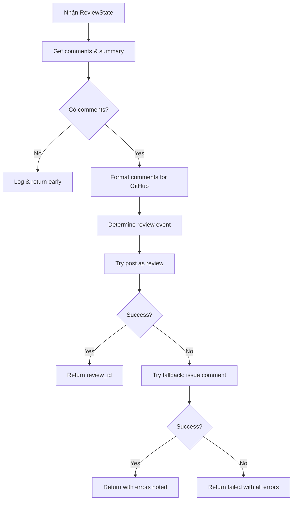
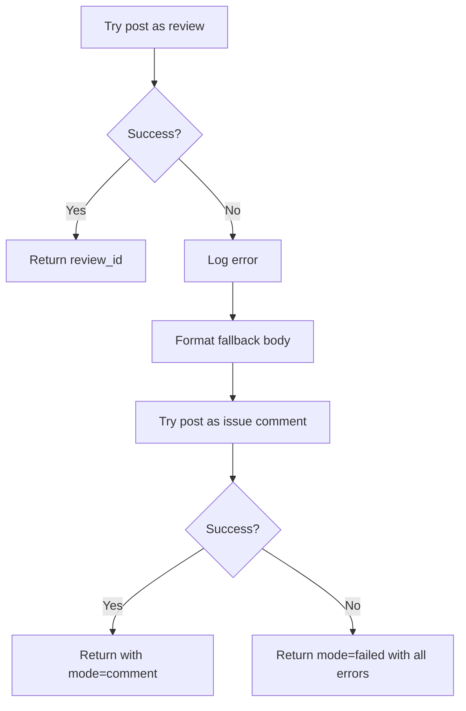

# GitHub Publisher Node

## 📋 Tổng quan

Node cuối cùng trong pipeline review, đăng review comments lên GitHub Pull Request.

**Đặc điểm:** External API integration với GitHub, handle formatting và error fallbacks.

---

## 🎯 Chức năng chính

1. **Post review to GitHub** - Đăng review với inline comments
2. **Format comments** - Format comments theo GitHub markdown
3. **Handle errors** - Fallback strategies khi post fail
4. **Determine review event** - REQUEST_CHANGES vs COMMENT
5. **Multi-language support** - Vietnamese, English, Japanese

---

## 📥 Input (State)

Node nhận vào `ReviewState` với các trường:

| Field | Type | Mô tả |
|-------|------|-------|
| `pr_context` | `PRContext` | Thông tin về PR |
| `comments` | `list[ReviewComment]` | Finalized comments |
| `summary` | `str` | Review summary markdown |
| `repo_config` | `ReviewerConfig` | Config (language, etc.) |

---

## 📤 Output (State Updates)

Node trả về dict cập nhật state với:

| Field | Type | Mô tả |
|-------|------|-------|
| `review_id` | `int` | GitHub review ID (nếu thành công) |
| `errors` | `list[str]` | Errors encountered (nếu có) |

### PublishResult structure:
```python
@dataclass
class PublishResult:
    review_id: int | None = None    # GitHub review ID
    errors: list[str] = None        # Error messages
    mode: str = "review"            # "review", "comment", "failed"
```

---

## 🔄 Quy trình xử lý



---

## 🛠️ Công nghệ sử dụng

### Dependencies:
- **GitHubService** (`app.services.github`): GitHub API client
- **CommentFormatter** (`agents.nodes.github_publisher.formatter`): Format comments
- **i18n** (`core.i18n`): Multi-language support

---

## 🌐 GitHub API Calls

### 1. Create Review (Primary)

**Endpoint**: `POST /repos/{owner}/{repo}/pulls/{pr_number}/reviews`

**Request**:
```json
{
    "body": "## 🤖 AI Code Review\n\n| Severity | Count |...",
    "event": "COMMENT" | "REQUEST_CHANGES",
    "comments": [
        {
            "path": "src/models/user.py",
            "line": 15,
            "body": "**🔴 Critical**\n\nBreaking change: added required parameter..."
        },
        {
            "path": "src/api/auth.py",
            "line": 45,
            "body": "**🟡 Warning**\n\nMissing error handling..."
        }
    ]
}
```

**Response**:
```json
{
    "id": 987654321,
    "user": {
        "login": "ai-reviewer[bot]",
        ...
    },
    "body": "## 🤖 AI Code Review...",
    "state": "COMMENTED",
    "html_url": "https://github.com/owner/repo/pull/123#pullrequestreview-987654321"
}
```

**Possible errors**:
- `422 Unprocessable Entity`: Invalid line numbers, files not in diff
- `403 Forbidden`: Insufficient permissions
- `404 Not Found`: PR doesn't exist
- `Rate limit exceeded`

---

### 2. Create Issue Comment (Fallback)

**Endpoint**: `POST /repos/{owner}/{repo}/issues/{issue_number}/comments`

**Request**:
```json
{
    "body": "## 🤖 AI Code Review Summary\n\n⚠️ Could not post inline comments...\n\n### Issues Found:\n\n..."
}
```

**Response**:
```json
{
    "id": 123456789,
    "body": "## 🤖 AI Code Review Summary...",
    "html_url": "https://github.com/owner/repo/issues/123#issuecomment-123456789"
}
```

---

## 🎨 Comment Formatting

### Inline Comment Format:

```python
def format_inline(comment: ReviewComment) -> str:
    """Format comment for GitHub inline display."""
    
    # Severity emoji
    severity_emoji = {
        "critical": "🔴",
        "warning": "🟡",
        "info": "🔵",
        "suggestion": "💡"
    }
    
    parts = [
        f"**{severity_emoji[comment.severity]} {comment.severity.title()}**",
        "",
        comment.message,
    ]
    
    # Add suggestion
    if comment.suggestion:
        parts.append("")
        parts.append("**💡 Suggestion:**")
        parts.append(f"```")
        parts.append(comment.suggestion)
        parts.append("```")
    
    # Add affected callers
    if comment.caller_refs:
        parts.append("")
        parts.append("**📞 Affected Callers:**")
        for ref in comment.caller_refs:
            parts.append(f"- `{ref.name}` in `{ref.file}:{ref.line}`")
    
    # Add dependencies
    if comment.dependency_refs:
        parts.append("")
        parts.append("**🔗 Dependencies:**")
        for ref in comment.dependency_refs[:3]:  # Limit to 3
            parts.append(f"- `{ref.name}` in `{ref.file}`")
    
    # Add confidence
    parts.append("")
    parts.append(f"*Confidence: {comment.confidence:.0%}*")
    
    return "\n".join(parts)
```

**Example output**:

```markdown
**🔴 Critical**

Breaking change: added required parameter 'email' but caller in auth.py does not pass it

**💡 Suggestion:**
```
def create_user(name, email=None):
    if email is None:
        email = generate_default_email(name)
    return User(name, email)
```

**📞 Affected Callers:**
- `handle_signup` in `src/api/auth.py:45`
- `admin_create_user` in `src/admin/users.py:120`

**🔗 Dependencies:**
- `User` in `src/models/user.py`
- `validate_email` in `src/validators.py`

*Confidence: 95%*
```

---

## 🎯 Review Event Determination

```python
def _determine_review_event(comments: list[ReviewComment]) -> str:
    """Determine GitHub review event."""
    
    has_critical = any(c.severity == "critical" for c in comments)
    
    if has_critical:
        return "REQUEST_CHANGES"  # Block merge
    else:
        return "COMMENT"  # Allow merge
```

**GitHub review events**:

| Event | Description | Effect |
|-------|-------------|--------|
| `COMMENT` | Normal review | Doesn't block merge |
| `APPROVE` | Approve changes | Counts as approval |
| `REQUEST_CHANGES` | Request changes | Blocks merge (requires approval) |

**Strategy**: Use `REQUEST_CHANGES` nếu có **critical** issues để force developer fix trước khi merge.

---

## 🔄 Fallback Strategy



### Fallback Body Format:

```markdown
## 🤖 AI Code Review Summary

⚠️ **Note**: Could not post inline comments. Showing summary instead.

### Issues Found:

#### 🔴 Critical Issues (2)

**src/models/user.py:15**
- Breaking change: added required parameter 'email' but caller in auth.py does not pass it
- Suggestion: Make email optional

**src/services/payment.py:234**
- SQL injection vulnerability in payment query
- Suggestion: Use parameterized query

#### 🟡 Warnings (3)

**src/api/auth.py:45**
- Missing error handling for user creation
- Suggestion: Add try-catch block

...
```

---

## 📊 Logging & Metrics

```python
# Start
log.info("github_publisher.started",
    pr=ctx.pr_number,
    total_comments=len(comments),
)

# No comments
log.info("github_publisher.no_comments",
    pr=ctx.pr_number
)

# Review posted
log.info("github_publisher.review_posted",
    review_id=review_id,
    pr=ctx.pr_number,
)

# Review failed
log.exception("github_publisher.review_failed")

# Fallback attempt
log.info("github_publisher.fallback_attempt")

# Fallback success
log.info("github_publisher.fallback_success",
    comment_id=comment_id
)

# Fallback failed
log.exception("github_publisher.fallback_failed")
```

---

## ⚡ Performance

- **Typical time**: 1-3 seconds
- **Rate limits**: 
  - Authenticated: 5,000 requests/hour
  - Typically uses 1-2 requests/PR
- **Batch comments**: All comments in single API call

---

## 🚨 Error Handling

### Common errors and handling:

#### 1. Invalid Line Numbers (422)

```json
{
    "message": "Validation Failed",
    "errors": [{
        "resource": "PullRequestReviewComment",
        "code": "invalid",
        "field": "line",
        "message": "line is not part of the diff"
    }]
}
```

**Handling**: Should not happen (validated in previous nodes), but fallback to issue comment.

#### 2. Permission Issues (403)

```json
{
    "message": "Resource not accessible by integration"
}
```

**Handling**: Fallback to issue comment (if allowed), or fail gracefully.

#### 3. Rate Limit (429)

```json
{
    "message": "API rate limit exceeded",
    "documentation_url": "https://docs.github.com/rest/overview/resources-in-the-rest-api#rate-limiting"
}
```

**Handling**: Retry with exponential backoff (handled by GitHubService).

---

## 🌍 Multi-language Support

### Comment formatting by language:

**English**:
```markdown
**🔴 Critical**
Breaking change detected...
```

**Vietnamese**:
```markdown
**🔴 Nghiêm trọng**
Phát hiện thay đổi breaking...
```

**Japanese**:
```markdown
**🔴 重大**
破壊的変更を検出...
```

### Language detection:

```python
language = config.language if config.language in ("en", "vi", "ja") else "en"
formatter = CommentFormatter(language, pr_context)
```

---

## 📝 Example

### Input state:
```python
{
    "pr_context": PRContext(
        owner="myorg",
        repo="myrepo",
        pr_number=123,
        installation_id=456789
    ),
    "comments": [
        ReviewComment(
            file="src/models/user.py",
            line=15,
            severity="critical",
            message="Breaking change: added required parameter...",
            suggestion="Make email optional",
            confidence=0.95,
            caller_refs=[...],
        ),
        ReviewComment(
            file="src/api/auth.py",
            line=45,
            severity="warning",
            message="Missing error handling...",
            confidence=0.85,
        )
    ],
    "summary": "## 🤖 AI Code Review\n\n| Severity | Count |\n...",
    "repo_config": ReviewerConfig(language="en")
}
```

### GitHub API Request:
```json
{
    "body": "## 🤖 AI Code Review\n\n| Severity | Count |\n...",
    "event": "REQUEST_CHANGES",
    "comments": [
        {
            "path": "src/models/user.py",
            "line": 15,
            "body": "**🔴 Critical**\n\nBreaking change: added required parameter...\n\n**💡 Suggestion:**\n```\nMake email optional\n```\n\n**📞 Affected Callers:**\n...\n\n*Confidence: 95%*"
        },
        {
            "path": "src/api/auth.py",
            "line": 45,
            "body": "**🟡 Warning**\n\nMissing error handling...\n\n*Confidence: 85%*"
        }
    ]
}
```

### Output state:
```python
{
    "review_id": 987654321,
    "errors": None
}
```

### If fallback:
```python
{
    "review_id": None,
    "errors": ["Review failed: 422 Unprocessable Entity"]
}
```

---

## 💡 Best Practices

### Formatting:

1. **Use emojis**: Visual markers for severity
2. **Clear structure**: Sections rõ ràng
3. **Actionable suggestions**: Cung cấp code examples
4. **Limit context**: Không quá verbose

### Error handling:

1. **Always try fallback**: Better than complete failure
2. **Log all errors**: For debugging
3. **Graceful degradation**: Summary better than nothing

### Performance:

1. **Batch comments**: All in single API call
2. **Retry on rate limit**: With backoff
3. **Async operations**: Don't block

---

## 🔗 Final Step

Đây là node cuối cùng trong pipeline. Sau khi complete:
- Review được hiển thị trên GitHub PR
- Developers nhận notifications
- PR có thể được merged (nếu không có critical issues)

---

## 🔮 Future Enhancements

1. **Rich formatting**: Tables, collapsible sections
2. **Interactive comments**: Reply to questions
3. **Auto-fix**: Suggest code fixes via commits
4. **Review threads**: Track issue resolution
5. **Custom templates**: Per-repo comment formats
