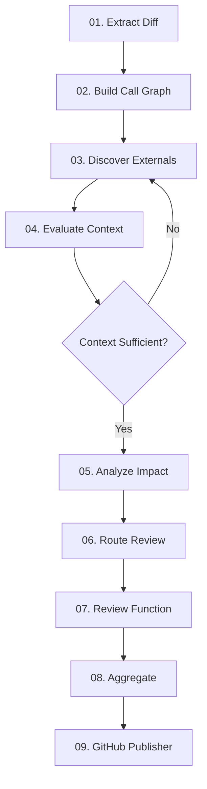

# Agent Nodes Documentation

Tài liệu chi tiết về từng node trong PR review pipeline.

## 📋 Tổng quan

Pipeline review gồm 9 nodes chính, chia thành 4 phases:

### Phase 1: Extract (Deterministic)
- **[01. Extract Diff](01-extract-diff.md)** - Parse PR diff và extract changed functions

### Phase 2: Analysis (Deterministic)
- **[02. Build Call Graph](02-build-call-graph.md)** - Xây dựng call relationships
- **[05. Analyze Impact](05-analyze-impact.md)** - Xác định impact levels

### Phase 2.5: Context Enrichment (LLM-guided)
- **[03. Discover Externals](03-discover-externals.md)** - Tìm external files (Optimizer)
- **[04. Evaluate Context](04-evaluate-context.md)** - LLM đánh giá context (Evaluator)

### Phase 3: Review (LLM-based)
- **[06. Route Review](06-route-review.md)** - Route functions to review depths
- **[07. Review Function](07-review-function.md)** - LLM review từng function

### Phase 4: Finalization (Post-processing)
- **[08. Aggregate](08-aggregate.md)** - Aggregate và deduplicate comments
- **[09. GitHub Publisher](09-github-publisher.md)** - Post review to GitHub

---

## 🔄 Pipeline Flow



---

## 📊 Node Characteristics

| Node | Phase | Uses LLM | API Calls | Typical Time |
|------|-------|----------|-----------|--------------|
| Extract Diff | 1 | ❌ | GitHub API | 1-2s |
| Build Call Graph | 2 | ❌ | - | <100ms |
| Discover Externals | 2.5a | ❌ | GitHub Search | 2-5s |
| Evaluate Context | 2.5b | ✅ | LLM API | 2-4s |
| Analyze Impact | 2b | ❌ | - | <50ms |
| Route Review | 3a | ❌ | - | <10ms |
| Review Function | 3b | ✅ | LLM API | 5-15s per fn |
| Aggregate | 4 | ❌ | - | <50ms |
| GitHub Publisher | 4 | ❌ | GitHub API | 1-3s |

**Total typical time**: 20-60 seconds per PR (depending on số functions)

---

## 🎯 State Flow

### Initial State:
```python
{
    "pr_context": PRContext(owner, repo, pr_number, branches, ...)
}
```

### After Extract Diff:
```python
{
    "pr_context": ...,
    "file_diffs": [FileDiff(...)],
    "function_changes": {...},
    "file_contents": {...}
}
```

### After Build Call Graph:
```python
{
    ...,
    "call_graph": CallGraph(relations={...})
}
```

### After Context Enrichment Loop:
```python
{
    ...,
    "external_files": [ExternalFile(...)],
    "context_sufficient": True,
    "evaluation_iteration": 2
}
```

### After Impact Analysis:
```python
{
    ...,
    "impact_report": ImpactReport(functions=[...], breaking_changes=[...]),
    "review_context": ReviewContext(functions=[...])
}
```

### After Route Review:
```python
{
    ...,
    "functions_to_review": [FunctionReviewInput(...)]
}
```

### After Review Function:
```python
{
    ...,
    "comments": [ReviewComment(...)],
    "review_failures": [...]
}
```

### After Aggregate:
```python
{
    ...,
    "final_comments": [ReviewComment(...)],
    "summary": "## 🤖 AI Code Review\n..."
}
```

### After GitHub Publisher:
```python
{
    ...,
    "review_id": 987654321,
    "errors": None
}
```

---

## 🔍 Quick Reference

### Deterministic Nodes (No LLM)
- ✅ **Fast**: < 5s combined
- ✅ **Reliable**: Consistent results
- ✅ **No cost**: No LLM API calls
- Nodes: Extract Diff, Build Call Graph, Analyze Impact, Route Review, Aggregate

### LLM-based Nodes
- ⏱️ **Slower**: 2-20s per call
- 💰 **Costs money**: API usage
- 🎯 **Intelligent**: Understands context
- Nodes: Evaluate Context, Review Function

### External API Nodes
- 🌐 **Network dependent**: Can be slow
- 🔒 **Auth required**: GitHub token
- 📊 **Rate limited**: GitHub API limits
- Nodes: Extract Diff, Discover Externals, GitHub Publisher

---

## 📚 Node Documentation Structure

Mỗi node doc bao gồm:

1. **📋 Tổng quan** - High-level description
2. **🎯 Chức năng chính** - Main responsibilities
3. **📥 Input** - State fields consumed
4. **📤 Output** - State fields produced
5. **🔄 Quy trình xử lý** - Processing flow
6. **🛠️ Công nghệ** - Tech stack and dependencies
7. **🌐 API Calls** - External API interactions
8. **📊 Logging** - What gets logged
9. **⚡ Performance** - Timing and optimization
10. **🚨 Error Handling** - Error scenarios
11. **🔗 Next Node** - What comes next
12. **📝 Example** - Real example with data
13. **💡 Best Practices** - Tips and recommendations

---

## 🎓 Learning Path

### Bắt đầu với:
1. [Extract Diff](01-extract-diff.md) - Hiểu cách parse PR
2. [Review Function](07-review-function.md) - Core LLM review logic
3. [Aggregate](08-aggregate.md) - Post-processing

### Sau đó:
4. [Build Call Graph](02-build-call-graph.md) - Dependencies
5. [Analyze Impact](05-analyze-impact.md) - Impact determination
6. [Route Review](06-route-review.md) - Routing logic

### Advanced:
7. [Discover Externals](03-discover-externals.md) - External discovery
8. [Evaluate Context](04-evaluate-context.md) - LLM evaluation
9. [GitHub Publisher](09-github-publisher.md) - GitHub integration

---

## 🔧 Development Guide

### Adding a New Node

1. **Create node file**: `src/agents/nodes/new_node.py`
2. **Implement `run()` function**:
   ```python
   async def run(state: ReviewState) -> dict:
       # Process state
       return {"new_field": value}
   ```
3. **Register in graph**: `src/agents/graph.py`
4. **Add tests**: `tests/unit/test_new_node.py`
5. **Document**: `docs/nodes/XX-new-node.md`

### Debugging Nodes

```python
# Enable debug logging
log.setLevel(logging.DEBUG)

# Add debug logs in node
log.debug("node.step", data=intermediate_result)

# Check state at each step
print(json.dumps(state, indent=2, default=str))
```

---

## 📊 Performance Optimization

### Bottlenecks:
1. **LLM calls** (Review Function) - ~60% of time
2. **GitHub API** (Extract Diff, Discover Externals) - ~30% of time
3. **Analysis** (Other nodes) - ~10% of time

### Optimization strategies:
- **Parallel LLM calls**: Use `asyncio.gather()` in Review Function
- **Cache GitHub API**: Cache file contents, search results
- **Limit functions**: Max 20 functions to review
- **Early exit**: Skip trivial changes

---

## 🐛 Common Issues

### Issue: LLM returns invalid line numbers
**Solution**: Validate line numbers in Review Function node

### Issue: GitHub API rate limit
**Solution**: Implement exponential backoff in GitHubService

### Issue: Too many comments
**Solution**: Increase limits in Aggregate node config

### Issue: Context loop never ends
**Solution**: Check MAX_ENRICHMENT_ITERATIONS in Evaluate Context

---

## 📞 Contact & Support

- **Documentation**: This folder
- **Code**: `src/agents/nodes/`
- **Tests**: `tests/unit/`
- **Architecture**: `docs/architecture/`

---

Cập nhật lần cuối: 2026-01-10
