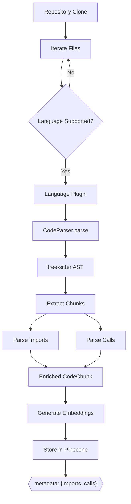
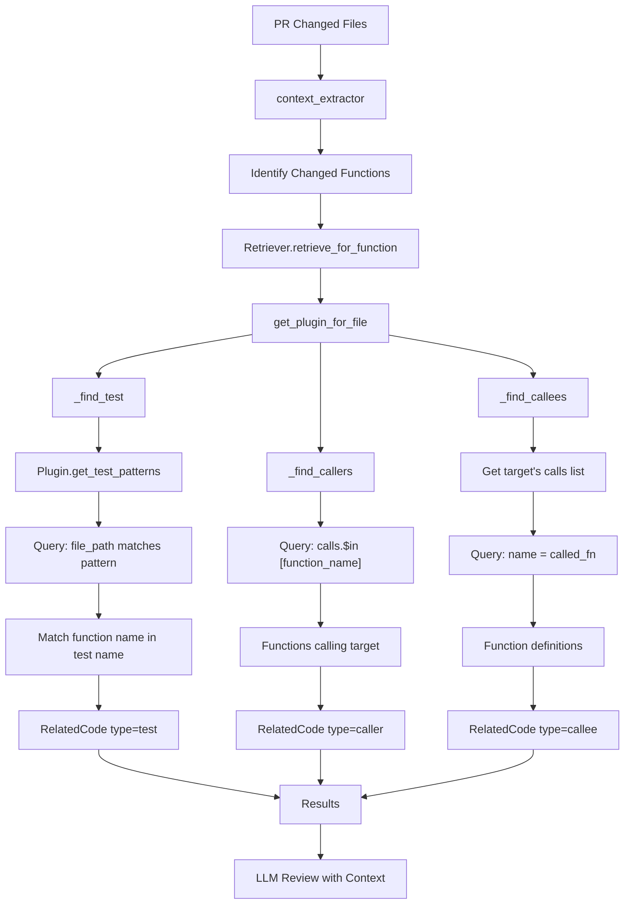

# RAG Context v2: Flow Diagrams

## Tổng Quan Luồng Hoạt Động

### 1. Indexing Flow (Khi index repository)



### 2. Retrieval Flow (Khi review code)



---

## Sequence Diagrams

### Indexing Sequence

```
Repository          Indexer         Parser          Plugin          VectorStore
    │                  │               │               │                 │
    │──clone──────────▶│               │               │                 │
    │                  │               │               │                 │
    │                  │──parse()─────▶│               │                 │
    │                  │               │               │                 │
    │                  │               │──get_plugin──▶│                 │
    │                  │               │◀──────────────│                 │
    │                  │               │               │                 │
    │                  │               │──parse_imports─▶│               │
    │                  │               │◀──imports──────│               │
    │                  │               │               │                 │
    │                  │               │──parse_calls───▶│               │
    │                  │               │◀──calls────────│               │
    │                  │               │               │                 │
    │                  │◀──ParseResult─│               │                 │
    │                  │               │               │                 │
    │                  │──embed + store───────────────────────────────▶│
    │                  │                                               │
    │                  │              metadata: {imports, calls}       │
    │                  │◀──────────────────────────────────────────────│
```

### Retrieval Sequence

```
ContextExtractor     Retriever         Plugin          VectorStore
       │                │                │                 │
       │──retrieve()───▶│                │                 │
       │                │                │                 │
       │                │──get_plugin───▶│                 │
       │                │◀─────plugin────│                 │
       │                │                │                 │
       │                │──get_test_patterns()──▶│        │
       │                │◀──patterns──────────────│        │
       │                │                         │        │
       │                │──query_by_metadata(file_path)───▶│
       │                │◀──test_matches───────────────────│
       │                │                                  │
       │                │──query_by_metadata(calls.$in)───▶│
       │                │◀──callers────────────────────────│
       │                │                                  │
       │                │──query_by_metadata(name)────────▶│
       │                │◀──callees────────────────────────│
       │                │                                  │
       │◀──[RelatedCode]│                                  │
       │                │                                  │
```

---

## Data Structures

### CodeChunk (sau khi parse)

```
┌─────────────────────────────────────────┐
│              CodeChunk                  │
├─────────────────────────────────────────┤
│ name: "calculate"                       │
│ content: "def calculate(x, y):..."      │
│ chunk_type: "function"                  │
│ file_path: "src/utils.py"               │
│ start_line: 5                           │
│ end_line: 10                            │
│ language: "python"                      │
│                                         │
│ ┌─────────────────────────────────────┐ │
│ │ imports: ["src.models", "typing"]   │ │
│ └─────────────────────────────────────┘ │
│                                         │
│ ┌─────────────────────────────────────┐ │
│ │ calls: ["helper", "validate"]       │ │
│ └─────────────────────────────────────┘ │
└─────────────────────────────────────────┘
```

### Pinecone Record

```
┌─────────────────────────────────────────┐
│           Pinecone Vector               │
├─────────────────────────────────────────┤
│ id: "src/utils.py:calculate:5"          │
│ values: [0.123, 0.456, ...]  # 1024-dim │
│                                         │
│ metadata:                               │
│ ┌─────────────────────────────────────┐ │
│ │ file_path: "src/utils.py"           │ │
│ │ name: "calculate"                   │ │
│ │ chunk_type: "function"              │ │
│ │ content: "def calculate..."         │ │
│ │ language: "python"                  │ │
│ │                                     │ │
│ │ imports: ["src.models"]  ◄── NEW    │ │
│ │ calls: ["helper"]        ◄── NEW    │ │
│ └─────────────────────────────────────┘ │
└─────────────────────────────────────────┘
```

### RelatedCode (kết quả retrieval)

```
┌─────────────────────────────────────────┐
│            RelatedCode                  │
├─────────────────────────────────────────┤
│ file_path: "tests/test_utils.py"        │
│ name: "test_calculate"                  │
│ content: "def test_calculate():..."     │
│ chunk_type: "function"                  │
│ relevance_score: 1.0                    │
│                                         │
│ ┌─────────────────────────────────────┐ │
│ │ relationship: "test"                │ │
│ │     (or "caller" or "callee")       │ │
│ └─────────────────────────────────────┘ │
└─────────────────────────────────────────┘
```

---

## Relationship Detection Logic

### TEST Detection

```python
# 1. Get test patterns from language plugin
patterns = plugin.get_test_patterns("src/utils.py")
# ["tests/test_utils.py", "test_utils.py", ...]

# 2. Query Pinecone for files matching patterns
for pattern in patterns:
    results = query_by_metadata(file_path=pattern)

# 3. Find test functions containing target function name
for result in results:
    if "calculate" in result.name.lower():
        return RelatedCode(relationship="test")
```

### CALLER Detection

```python
# Query for functions that have target in their calls list
results = query_by_metadata(
    filter={
        "calls": {"$in": ["calculate"]},
        "file_path": {"$ne": "src/utils.py"}
    }
)
# Returns: functions that call calculate()
```

### CALLEE Detection

```python
# 1. Get target function's calls list
current = query_by_metadata(
    file_path="src/utils.py",
    name="calculate"
)
# current.calls = ["helper", "validate"]

# 2. Find definitions for each called function
for called_name in current.calls:
    results = query_by_metadata(name=called_name)
    # Returns: definition of helper(), validate()
```
