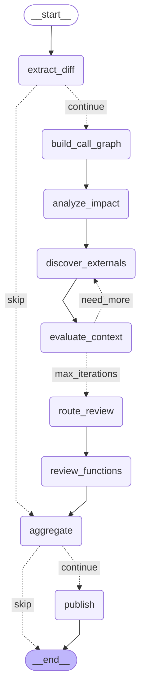

# LangGraph Workflow Visualization

```mermaid
---
config:
  flowchart:
    curve: linear
---
graph TD;
	__start__([<p>__start__</p>]):::first
	extract_diff(extract_diff)
	build_call_graph(build_call_graph)
	analyze_impact(analyze_impact)
	discover_externals(discover_externals)
	evaluate_context(evaluate_context)
	route_review(route_review)
	review_functions(review_functions)
	aggregate(aggregate)
	publish(publish)
	__end__([<p>__end__</p>]):::last
	__start__ --> extract_diff;
	aggregate -. &nbsp;skip&nbsp; .-> __end__;
	aggregate -. &nbsp;continue&nbsp; .-> publish;
	analyze_impact --> discover_externals;
	build_call_graph --> analyze_impact;
	discover_externals --> evaluate_context;
	evaluate_context -. &nbsp;need_more&nbsp; .-> discover_externals;
	evaluate_context -. &nbsp;max_iterations&nbsp; .-> route_review;
	extract_diff -. &nbsp;skip&nbsp; .-> aggregate;
	extract_diff -. &nbsp;continue&nbsp; .-> build_call_graph;
	review_functions --> aggregate;
	route_review --> review_functions;
	publish --> __end__;
	classDef default fill:#f2f0ff,line-height:1.2
	classDef first fill-opacity:0
	classDef last fill:#bfb6fc

```
