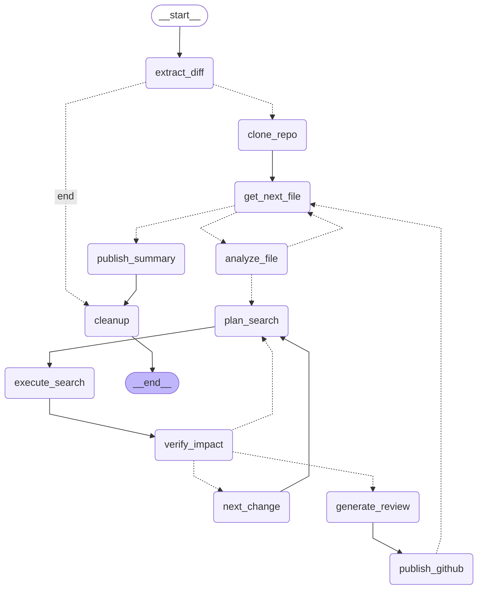

# LangGraph Workflow Visualization

```mermaid
---
config:
  flowchart:
    curve: linear
---
graph TD;
	__start__([<p>__start__</p>]):::first
	extract_diff(extract_diff)
	clone_repo(clone_repo)
	get_next_file(get_next_file)
	analyze_file(analyze_file)
	plan_search(plan_search)
	execute_search(execute_search)
	verify_impact(verify_impact)
	next_change(next_change)
	generate_review(generate_review)
	publish_github(publish_github)
	publish_summary(publish_summary)
	cleanup(cleanup)
	__end__([<p>__end__</p>]):::last
	__start__ --> extract_diff;
	analyze_file -.-> get_next_file;
	analyze_file -.-> plan_search;
	clone_repo --> get_next_file;
	execute_search --> verify_impact;
	extract_diff -. &nbsp;end&nbsp; .-> cleanup;
	extract_diff -.-> clone_repo;
	generate_review --> publish_github;
	get_next_file -.-> analyze_file;
	get_next_file -.-> publish_summary;
	next_change --> plan_search;
	plan_search --> execute_search;
	publish_github -.-> get_next_file;
	publish_summary --> cleanup;
	verify_impact -.-> generate_review;
	verify_impact -.-> next_change;
	verify_impact -.-> plan_search;
	cleanup --> __end__;
	classDef default fill:#f2f0ff,line-height:1.2
	classDef first fill-opacity:0
	classDef last fill:#bfb6fc

```
