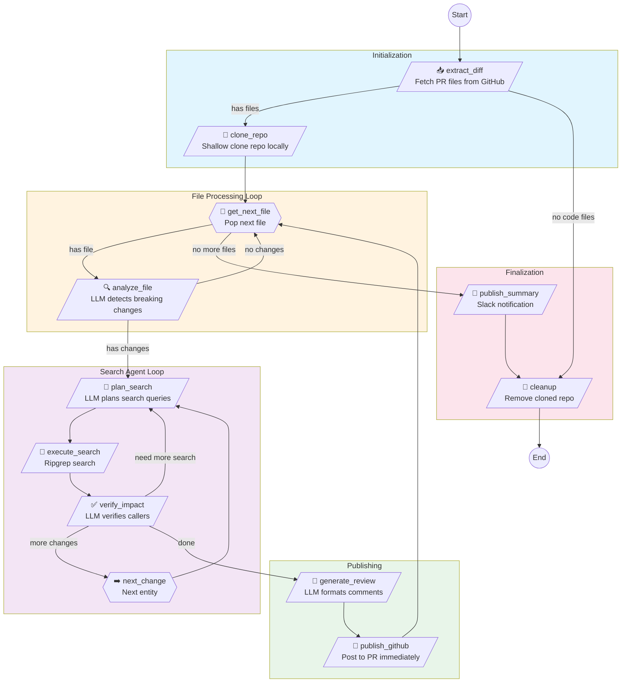

# PR Review Workflow Graph v2

## Overview

File-by-file processing with immediate GitHub publishing and LLM-driven search.

## Mermaid Diagram



## Node Descriptions

| Node | Type | Description |
|------|------|-------------|
| `extract_diff` | GitHub API | Fetches all changed files in PR with content |
| `clone_repo` | Git | Shallow clone with `--depth 1 --filter=blob:limit=1m` |
| `get_next_file` | Control | Pops next file from queue, resets per-file state |
| `analyze_file` | LLM | Detects breaking changes (functions, constants, etc.) |
| `plan_search` | LLM | Decides search queries based on language/entity |
| `execute_search` | Ripgrep | Fast local search, no rate limits |
| `verify_impact` | LLM | Confirms which callers will actually break |
| `next_change` | Control | Moves to next entity in current file |
| `generate_review` | LLM | Formats review comments with context |
| `publish_github` | GitHub API | Posts comments immediately to PR |
| `publish_summary` | Slack | Sends final summary notification |
| `cleanup` | Filesystem | Removes cloned repo |

## State Flow

```
PRContext → file_diffs → pending_files → current_file
                                              ↓
                                        file_changes → current_change
                                              ↓
                                        search_plan → search_results
                                              ↓
                                        verified_callers → file_breaking_changes
                                              ↓
                                        file_comments → published_comments
                                              ↓
                                        all_breaking_changes → all_comments
```

## Key Features

1. **File-by-file processing**: Each file is fully processed before moving to next
2. **Immediate publishing**: Comments posted to GitHub as soon as ready
3. **LLM-driven search**: AI decides what to search based on language/context
4. **Search refinement loop**: Can request additional searches if needed
5. **Automatic cleanup**: Cloned repo removed on completion or error
